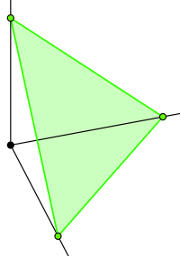

```{r setup, include=FALSE}
knitr::opts_chunk$set(echo = TRUE)

library(tidyverse)
library(dirichlet)
```

# Introduction

My girlfriend and I have been attending a weekly Dungeons & Dragons night at a local board game cafe, which means that we have been thoroughly immersed in the superstition surrounding the dice. We have heard stories of unlikely strings of bad rolls that ultimately lead to the frustrated fellow adventurer performing the [salt water test](https://www.youtube.com/watch?v=VI3N4Qg-JZM) to see if the dice are balanced poorly. This test is really cool, and it certainly explains the physical mechanism for why a die will come up on some faces more than others, but it doesn't tell you anything about the probabilities of rolling each face. Even with an off balance die, say a d20 that's weighted in favour of rolling a twenty, we shouldn't expect every normal roll on a hard surface to come up twenty. How frequently it comes up will presumably depend on the severity of the balance issue. As an aspiring data scientist I couldn't help but think that a much better approach would be a Bayesian analysis for estimating the probability of rolling each face. 

Normally I don't care too much about such superstitions and just take the rolls as they come. I probably never would have implemented this Bayesian analysis, if not for the fact that I have developed a bit of a reputation for rolling high damage numbers on my d10 at our table. The curiosity has now gotten the better of me and I want better estimates of the true probabilities for my dice.


# Methodology

There are a couple different ways I can think of to assess if my dice are correctly balanced. I could always use a simple frequentist hypothesis test and set a null hypothesis of **p** being equal to the fair probability for each face. I could then roll the dice many times and see if the observed data provides enough evidence to reject that hypothesis that the dice is fair. This is a nice and simple approach, which would be straight forward to test using the multinomial or binomial distribution. But there are a couple of drawbacks to this approach that I can immediately think of:

<ol> 
  <li>It tells us nothing about what a better estimate of the probability for each face is; and</li>
  <li>We will likely need a lot more data to achieve significance using this frequentist approach.</li>
</ol>

Instead, I think a Bayesian approach will be much more informative. We have a couple options available to us: We can use a numerical approach like MCMC, and compute the posterior distributions for each face that way. Or we can try to find an analytically tractable way of computing the posterior given a specific type of prior, called a conjugate prior. Luckily for us, there are two useful conjugate priors we will want to consider. They are the beta-binomial distribution, and the more general dirichlet-multinomial distribution. Ultimately I will end up using both of these in this analysis.

The dirichlet-multinomial model allows us to model an n-dimensional system of discrete events with varying probabilites that all sum to one. Essentially a dice. The beta-binomal model is a special case of the dirichlet-multinomial model in which n = 2, and it basically describes a coin. I feel that it is best to cover the simpler Beta distribution and the beta-binomial model before going into the more general Dirichlet distribution and dirichlet-multinomial model.

In our bayesian approach we get to start with a prior belief of what the probability of rolling a specific face of the die is, and then using a set of data from real rolls, we can update the distribution of probabilities for that face. The beta-binomial model is a special conjugate prior model in bayesian statistics, which is just a fancy way of saying that if we start with a beta distribution for the probability **p** of rolling a certain face of the dice, and then gather data that fits a binomial distribution, we can find a new beta distribution that describes the posterior probability of rolling that face. 

The probability mass function of the binomial distribution is simply:

$$ \frac{n!}{k!(n-k)!} p^k(1-p)^{n-k}$$

Where n is the total number of trials, k is the number of successes, and p is the probability of a success.

As for the beta-binomial model, I will skip the math and just assert that this rule for updating the probability distribution is simply:  

$$Prior = Beta(\alpha 0,\beta 0)$$
$$Posterior = Beta(\alpha 0 + successes,\beta 0 + failures)$$

Where $\alpha 0$ and $\beta 0$ are parameters of our prior beta distribution, successes is the number of times we rolled our chosen face, and failures is the number of times we rolled any other face. This means that before we get started we need to determine a reasonable beta prior to use. Let's consider the analysis of a twenty sided dice for the rest of this section. If we honestly knew nothing about dice, we might decide that any value of **p** is just as likely as the rest, and assign a uniform prior distribution. This can be achieved with $Beta(1,1)$:

```{r, Beta(1,1)}
ggplot(data.frame(x = c(0:1))) + 
  stat_function(fun = dbeta, 
                args = list(shape1 = 1, shape2 = 1)) +
  stat_function(fun = dbeta, 
                args = list(shape1 = 1, shape2 = 1),
                xlim = c(0,1),
                geom = "area",
                aes(x, alpha = 0.5)) +
  labs(title = "Beta(1,1) Distribution",
       x = "Binomial probability, p",
       y = "Probability density of p") +
  theme(legend.position="none")
```

We will go forward assuming that we know a little bit about dice, and that our prior belief in the likelihood of any given face is based on the dice being fair. For our d20, this means we expect **p = 0.05**. To model this as a prior we could simply say that we expect 1 roll out of twenty to be our face, and model it with $Beta(1,19)$:

```{r, Beta(1,19)}
ggplot(data.frame(x = c(0:1))) + 
  stat_function(fun = dbeta, 
                args = list(shape1 = 1, shape2 = 19)) +
  stat_function(fun = dbeta, 
                args = list(shape1 = 1, shape2 = 19),
                xlim = c(0,1),
                geom = "area",
                aes(x, alpha = 0.5)) +
  labs(title = "Beta(1,19) Distribution",
       x = "Binomial probability, p",
       y = "Probability density of p") +
  theme(legend.position="none")
```

Notice that this isn't a very confident prior distribution. We can see a decent likelihood for values of **p** anywhere between 0 and 0.25. If we want a stronger prior we can use larger values of $\alpha$ and $\beta$ where $\alpha / (\alpha + \beta) = 0.05$. Let's look at $Beta(5,95)$:

```{r, Beta(5,95)}
ggplot(data.frame(x = c(0:1))) + 
  stat_function(fun = dbeta, 
                args = list(shape1 = 5, shape2 = 95)) +
  stat_function(fun = dbeta, 
                args = list(shape1 = 5, shape2 = 95),
                xlim = c(0,1),
                geom = "area",
                aes(x, alpha = 0.5)) +
  labs(title = "Beta(5,95) Distribution",
       x = "Binomial probability, p",
       y = "Probability density of p") +
  theme(legend.position="none")
```

That's a bit better. There is a definite peak around **p = 0.05** with a much tighter spread. You may find it strange that we are going through all this effort just to maintain uncertainty about the value of p. Isn't our goal to get more confident in the true probability of rolling a certain face? It seems counter intuitive, but the power of Bayesian statistics is that we can continually work with uncertainty in our estimates, and that we treat **p** as a probability density function rather than a point estimate. This is true in both the prior and the posterior. Think of it as a means of not just finding a new most likely value for p, but also finding our uncertainty in this estimate of p, so that we know what we aren't sure of. If we wanted to find some common summary statistics for **p** from a beta distribution (either the prior or the posterior), we can do it with the following formulas and functions:

$$Mean = \frac{\alpha}{\alpha + \beta}$$

$$Median = qbeta(0.5, \alpha, \beta)$$

$$Mode = \frac{\alpha - 1}{\alpha + \beta -2}$$

More important than these summary statistics, however, is our ability to calculate a credible interval for the beta distribution. This gives us something similar to a frequentist confidence interval, except that we can say that we believe there is a certain probability that the interval contains the true parameter (in this case, p) given our assumptions (our prior). Much like the median, the credible interval can be found by passing the appropriate quantiles to the qbeta function for our posterior. For a 95% credible interval, these would be 0.025 for the lower bound an 0.975 for the upper bound.

As an example, let's consider our d20 dice. We believe that the dice is fair, and we are interested in determining the posterior probability of rolling a one on it to verify that it is actually fair. We start with a beta(5,95) distribution as our prior and we roll the dice 100 times. In these hundred rolls, we observe a one twenty times, and faces other than a one for the remaining 80 times. Using the beta-binomial updaing rule from earlier, our posterior is simply:

$$Posterior = Beta(5 + 20,95 + 80) = Beta(25,175)$$

And the mean of this posterior distribution is:

$$Mean = \frac{\alpha}{\alpha + \beta} = \frac{25}{25 + 175} = 0.125$$

Notice that because we had a prior equivalent to 100 points of data, and collect another 100 points of data to update it, that the new posterior is right in the middle of our prior of *p = 0.05* and our observed proportion of *0.20*.

Plotting the prior and posterior distributions together, we can see this shift:

```{r, beta-binomial-updating-example}
ggplot(data.frame(x = c(0:1))) + 
  stat_function(fun = dbeta, 
                args = list(shape1 = 5, shape2 = 95),
                color = "blue") +
  stat_function(fun = dbeta, 
                args = list(shape1 = 5, shape2 = 95),
                xlim = c(0,1),
                geom = "area",
                aes(x, alpha = 0.5),
                fill = "blue") +
  stat_function(fun = dbeta, 
                args = list(shape1 = 25, shape2 = 175),
                color = "red") +
  stat_function(fun = dbeta, 
                args = list(shape1 = 25, shape2 = 175),
                xlim = c(0,1),
                geom = "area",
                aes(x, alpha = 0.5),
                fill = "red") +
  labs(title = "Beta(5,95) Prior Distribution and Beta(25,175) Posterior Distribution",
       x = "Binomial probability, p",
       y = "Probability density of p") +
  theme(legend.position="none")
```

Notice that the high observed frequency of rolled ones has really shifted the distribution for the probability upwards from **p = 0.05**. It has also widened our posterior distribution compared to our prior, because we are now more uncertain about the probability of rolling a one after such an unexpected result from 100 rolls. A nice feature of bayesian statisticsis is that we can take a posterior distribution and use it as our new prior while we continue testing the dice. Let's pretend that after seeing this result we are not satisfied, so we decide to roll the dice 1000 more times and observe 203 ones:

$$Posterior = Beta(25 + 203,175 + 797) = Beta(228,972)$$

$$Mean = \frac{228}{228 + 972} = 0.190$$

```{r, beta-binomial-updating-example-two}
ggplot(data.frame(x = c(0:1))) + 
  stat_function(fun = dbeta, 
                args = list(shape1 = 25, shape2 = 175),
                color = "blue") +
  stat_function(fun = dbeta, 
                args = list(shape1 = 25, shape2 = 175),
                xlim = c(0,1),
                geom = "area",
                aes(x, alpha = 0.5),
                fill = "blue") +
  stat_function(fun = dbeta, 
                args = list(shape1 = 228, shape2 = 972),
                color = "red") +
  stat_function(fun = dbeta, 
                args = list(shape1 = 228, shape2 = 972),
                xlim = c(0,1),
                geom = "area",
                aes(x, alpha = 0.5),
                fill = "red") +
  labs(title = "Beta(25,792) Prior Distribution and Beta(228,972) Posterior Distribution",
       x = "Binomial probability, p",
       y = "Probability density of p") +
  theme(legend.position="none")
```

We can see that the posterior distribution has narrowed, and the mean has moved further towards the right to *p = 0.190*. This illustrates a useful feature of bayesian statistics: As we collect more data, our chosen prior has less influence and becomes less important.

This is how the beta-binomial model works when we only care about one face, but what about if we are interested in every face of the dice? To answer that, let's look at the dirichlet distribution and the dirichlet-multinomial model. We will consider a made up dice that only has three faces, because it will be very difficult to visualize anything higher.

The multinomial distribution is just a higher dimension version of the binomial distribution. In a binomial distribution the probabilty of a failure can be inferred from the probability of a success since there is a constraint that both outcomes must sum to a total probability of 1. In the multinomial we no longer have success and failure, but outcomes 1,2,...,k each with their own probabilities, $p_i$:

$$ f(x_1,...,x_k, p1,...,pk) = \frac{n!}{x_1! x_2! ... x_k!}p_1^{x_1}p_2^{x_2} ... p_k^{x_k}$$
Subject to the constaints:

$$ \sum_{i=1}^{n} x_i = n $$
and

$$ \sum_{j=1}^{k} p_j = 1 $$

Hopefully the similarity of the multinomial model to the binomial model is evident. A dirichlet distribution is a higher dimensional generalization of the beta distribution we saw earlier, and so the updating rules for it should also look familiar:

$$Prior = Dir(\theta_1,\theta_2, ..., \theta_k)$$
$$Posterior = Dir(\theta_1 + x_1,\theta_2 + x_2, ..., \theta_k + x_k)$$

But what does a Dirichlet distribution look like? To figure this out we will need to resort to some fancy three dimensional plots. For a three dimensional dirichlet distribution, our probability densities exist on the triangualr surface formed by the equation:

$$ p_1 + p_2 + p_3 = 1 $$



A probability density function defined by the dirichlet distribution exists on this surface:

```{r}
pdf <- function(v) ddirichlet(v, c(5, 5, 5))
mesh <- simplex_mesh(.0025) %>% as.data.frame %>% tbl_df
mesh$pdf <- mesh %>% apply(1, function(v) pdf(bary2simp(v)))
  
ggplot(mesh, aes(x, y)) +
  geom_raster(aes(fill = pdf)) +
  coord_equal(xlim = c(0,1), ylim = c(0, .85))
```

And as we update our dirichlet distribution using the rules above, it can shift the probability just like we saw for the beta distribution:

```{r}
pdf <- function(v) ddirichlet(v, c(5, 5, 15))
mesh <- simplex_mesh(.0025) %>% as.data.frame %>% tbl_df
mesh$pdf <- mesh %>% apply(1, function(v) pdf(bary2simp(v)))
  
ggplot(mesh, aes(x, y)) +
  geom_raster(aes(fill = pdf)) +
  coord_equal(xlim = c(0,1), ylim = c(0, .85))
```

Unfortunately these visualizations don't work so well for dice with more than three faces since it is hard to visualize four or more dimensions.

The dirichlet distribution has a very similar form for the mean as the beta distribution for each of it's dimensions p_i:

$$E[p_i] = \frac{\theta_i}{\sum_{i=1}^{k} \theta_i} $$
In fact, if we were to just define $\beta$ as the sum of all the $\theta$s except $\theta_i$, and rename $\theta_i$ to $\alpha$, then the mean posterior probability for $\theta_i$ becomes indistinguishable from a beta distribution defined for $\theta_i$ and $\neg  \theta_i$.

If we want the know a 95% credible interval for each face, then we can use this same trick to reduce each face of the dice to it's own beta distribution and find the confidence interval for that. The only caveat to this is that we need to remember that the distributions for each **p** originally came from a dirichlet distribution, and so the condition that the sum of all p equal one still remains. This just means that if the true value for one of the **p** is actually lower than our posterior mean probability, then it is necessary that one or more of the other faces has a **p** higher than it's posterior mean in an amount that cumulatively offsets the difference in the first **p**.

I think that's more than enough background. Let's start analyzing!


# Analysis

Rather than duplicating a bunch of code for each dice, I will just start by writing a function that can be reused. The parameters passed to the function are:

<ol>
  <li>**roll_data:** An integer vector containing the sequence of roll results.</li>
  <li>**faces:** The number of faces on the dice being analyzed</li>
  <li>**beta_prior_a:** The value of the alpha parameter to be used in the beta prior distribution</li>
  <li>**beta_prior_b:** The value of the beta parameter to be used in the beta prior distribution</li>
</ol>

```{r, Bayesian-Dice-Analysis}
bayesian_dice_analysis <- function(roll_data, faces = 20, beta_prior_a = 1, beta_prior_b = 1) {
  
  # Check that no rolls fall outside 1:faces
  if ((sum(roll_data > faces) + sum(roll_data < 0)) > 0) {
    stop(sprintf("Values outside the range 0 to %i were found in the data. Please ensure the faces parameter is correct and check that the data is valid.", faces))
  } 
  
  # Check that alpha and beta are non-negative
  if (beta_prior_a < 0 || beta_prior_b < 0) {
    stop("The alpha and beta priors must both be non-negtive. Please ensure the values specified are correct.") 
  }
  
  results_table <- tibble(face = c(1:faces))
  
  # Figure our the number of successes per face
  # Not sure how to do this inside a mutate function below
  successes <- c()
  for (i in 1:faces) {
    successes <- rbind(successes, sum(roll_data == i))
  }
  
  # Add columns for the count of binomial successes and failures
  results_table <- results_table %>% 
                    mutate(successes = successes,
                           failures = length(roll_data) - successes)
  
  # Add the values related to the posterior distribution
  results_table <- results_table %>%
                    mutate(beta_post_a = beta_prior_a + successes,
                           beta_post_b = beta_prior_b + failures,
                           posterior_mean = beta_post_a / (beta_post_a + beta_post_b),
                           posterior_median = qbeta(0.5, beta_post_a, beta_post_b),
                           posterior_mode = (beta_post_a - 1) / (beta_post_a + beta_post_b - 2),
                           ci_95_lower = qbeta(0.025, beta_post_a, beta_post_b),
                           ci_95_upper = qbeta(0.975, beta_post_a, beta_post_b))
  
  return(results_table)
}
```

The d10 dice is the one that I am really concerned about, so let's start with it:

```{r, d10, message = FALSE}
d10_data <- read_csv("d10.csv")
d10_result <- bayesian_dice_analysis(d10_data$Rolls, faces = 10, beta_prior_a = 10, beta_prior_b = 90)

ggplot(d10_result, aes(x = face, y = posterior_mean)) + 
  geom_point() +
  geom_errorbar(aes(ymin = ci_95_lower, ymax = ci_95_upper), colour = "black", width = 0.1) +
  geom_hline(aes(yintercept = 0.10, color = "red")) +
  theme(legend.position = "none") +
  coord_flip() +
  ggtitle("Posterior Probablities for Each Face of My d10 Dice")
```

It definitely looks like my d10 is a little unbalanced, and in a favourable way for me.

```{r, d20, message = FALSE}
d20_data <- read_csv("d20.csv")
d20_result <- bayesian_dice_analysis(d20_data$Rolls, faces = 20, beta_prior_a = 5, beta_prior_b = 95)

ggplot(d20_result, aes(x = face, y = posterior_mean)) + 
  geom_point() +
  geom_errorbar(aes(ymin = ci_95_lower, ymax = ci_95_upper), colour = "black", width = 0.1) +
  geom_hline(aes(yintercept = 0.05, color = "red")) +
  theme(legend.position = "none") +
  coord_flip() +
  ggtitle("Posterior Probablities for Each Face of My d20 Dice")
```

```{r, d102}
d10_data <- read_csv("d10.csv")
d10_result <- bayesian_dice_analysis(d10_data$Rolls, faces = 10, beta_prior_a = 10, beta_prior_b = 90)

ggplot(d10_result, aes(x = face, y = posterior_mean)) + 
  geom_point() +
  geom_errorbar(aes(ymin = ci_95_lower, ymax = ci_95_upper), colour = "black", width = 0.1) +
  geom_hline(aes(yintercept = 0.10, color = "red")) +
  theme(legend.position = "none") +
  coord_flip()
```
