+++
title = "Solar Powered Robot Bugs!"
description = "A microcontroller free solar powered autonomous robot based on BEAM robotics principles. Robotics kit sold by Solarbotics Ltd."
date = 2011-12-27T02:03:12+00:00
authors = ["Everett Robinson"]
aliases = ["/2011/12/27/solar-powered-robot-bugs/"]

[taxonomies]
tags = ["Electronics", "Kits", "Robotics", "Solarbotics"]

[extra]
feature_image = "dscf27821.jpg"
+++

  <a href="dscf2781.jpg">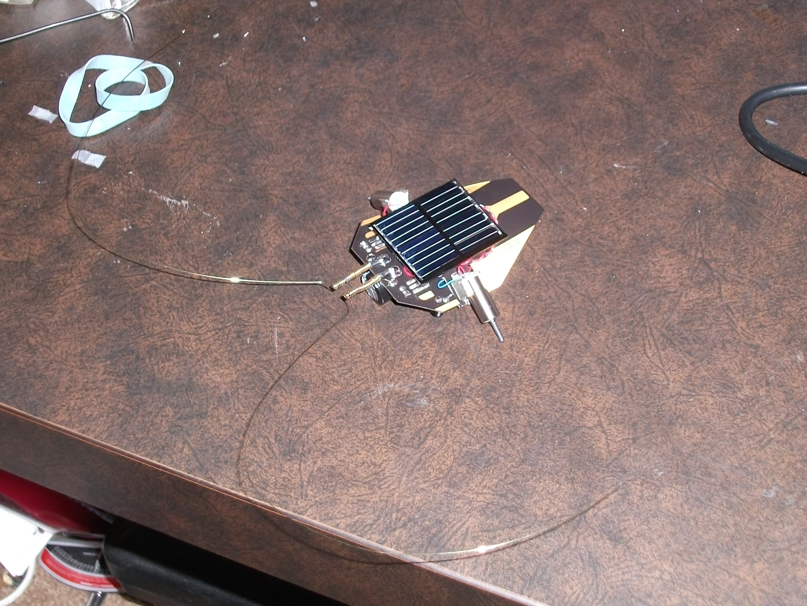</a>

  

    The finished product
  

  <a href="dscf2751.jpg">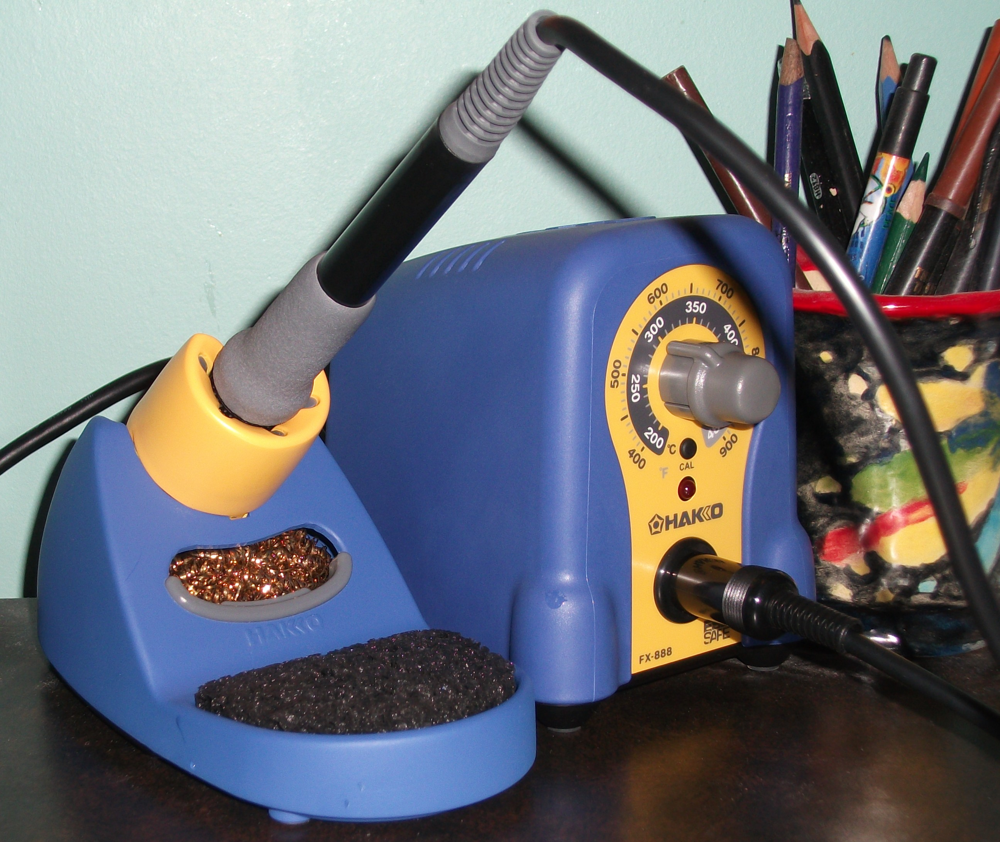</a>

  

    My new Hakko FX-888 soldering station
  

  This is not a project in which I spent much time designing or planning things myself, but I had a lot of fun with it, and it let me try out my brand new Hakko soldering station. It simply entails the assembly of the <a href="http://www.solarbotics.com/products/k_pp/">Photopopper Photovore robot kit</a> from <a href="http://www.solarbotics.com">Solarbotics.com</a> . What is a Photopopper Photovore? It&#8217;s basically a small solar powered robot, which uses Infrared and tactile sensors to simultaneously move towards sources of light and avoid obstacles. It also bears resemblance to an insect, especially a stinkbug. This kit really interests me, because the &#8220;behaviour&#8221; of the robot is caused through hardwired circuitry alone, and no microcontrollers or code are needed. The description included by Solarbotics says it is based on something called MillerEngine technology which (in all honesty) means nothing to me. Regardless, the circuit isn&#8217;t overly difficult to follow, and one need not know what a MillerEngine is to appreciate it.

  <a href="photopoppercircuit.png">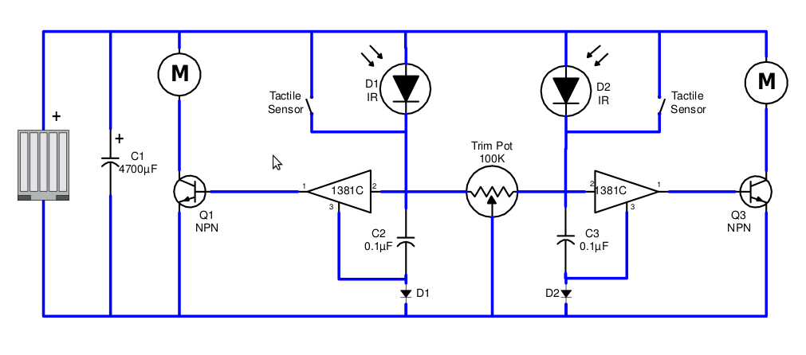</a>

  

    The Photopopper Photovore circuit
  

Since I am only a hobbyist, my assessment may not be correct, but hopefully I&#8217;m not too far off the mark. Essentially what happens is that the solar cell charges the large 4.7mF capacitor (C1), and then when the voltage in the capacitor is high enough, the voltage trigger on one of the sides engages.The determination of which voltage trigger is engaged is determined by the IR and tactile sensors, where the tactile sensors take priority over the IR sensors to ensure obstacle avoidance in addition to the light seeking behaviour. The voltage trigger then trips the corresponding transistor which applies a current across the motor on that side until the voltage  drops enough to disengage the voltage trigger. The small capacitors (C2 and C3) are responsible for determining the length and frequency of the motor activity by affecting the voltage at the voltage triggers, and the diodes simply make sure the current moves in the correct direction. The trimpot makes it possible to tune the robot to favor one side over the other, or to balance it so that it moves directly towards sources of light.

Before going further, I feel like it would be a good idea to make it clear that this project was very enjoyable even though I encountered several issues while working on it. I wouldn&#8217;t want to discourage anyone from taking it on simply because I like to complain about things.

  <a href="dscf2749.jpg">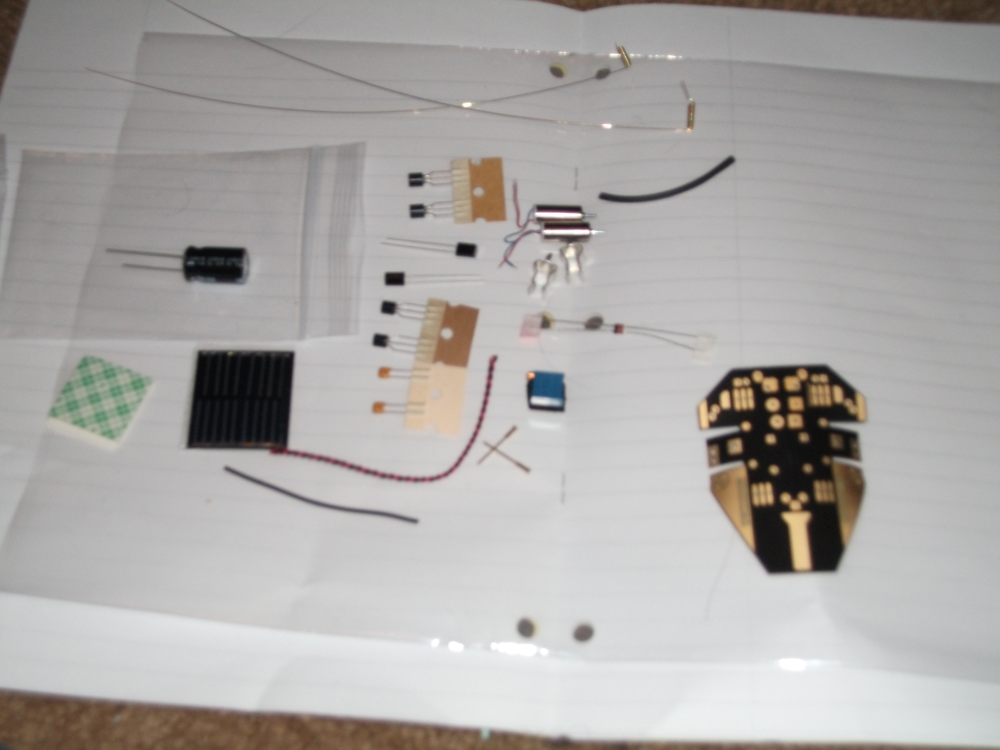</a>

  

    The components all laid out (I apologize for the blurriness)
  

The assembly instructions were good, and I really can&#8217;t complain too much in that regard. To start, you are shown a parts list, so you can be sure you have all the necessary components before proceeding. The most interesting part in this kit is probably the PCB, which is cut and formed to make this robot recognizable as an insect. In addition, there is  a large capacitor, trimpot, solar cell, and a pair each of diodes, voltage triggers, transistors, capacitors, motors, IR sensors, and the components to make each antenna (the tactile sensors).

  <a href="dscf2764.jpg">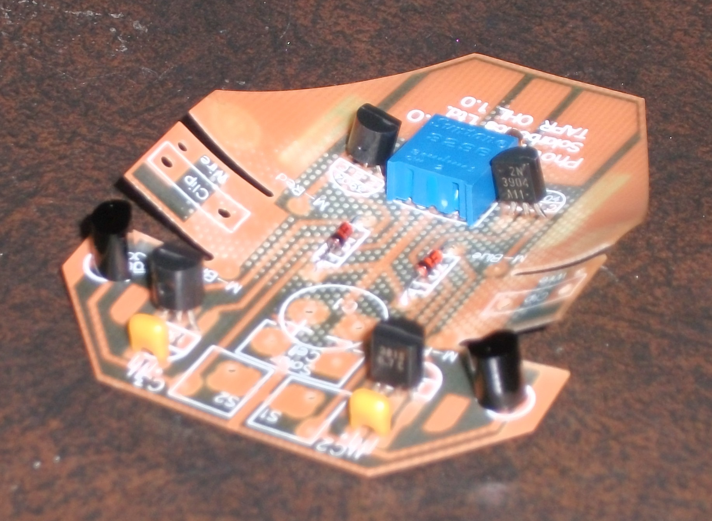</a>

  

    The underside with the voltage triggers, diodes, transistors, capacitors and trimpot installed
  

The first components to be installed are the voltage triggers, trimpot, and diodes, followed by the transistors and small capacitors. After this, the IR sensors are added. The installation of all these components was fairly straight forward, and was easily accomplished with the new soldering iron.

  <a href="dscf2771.jpg">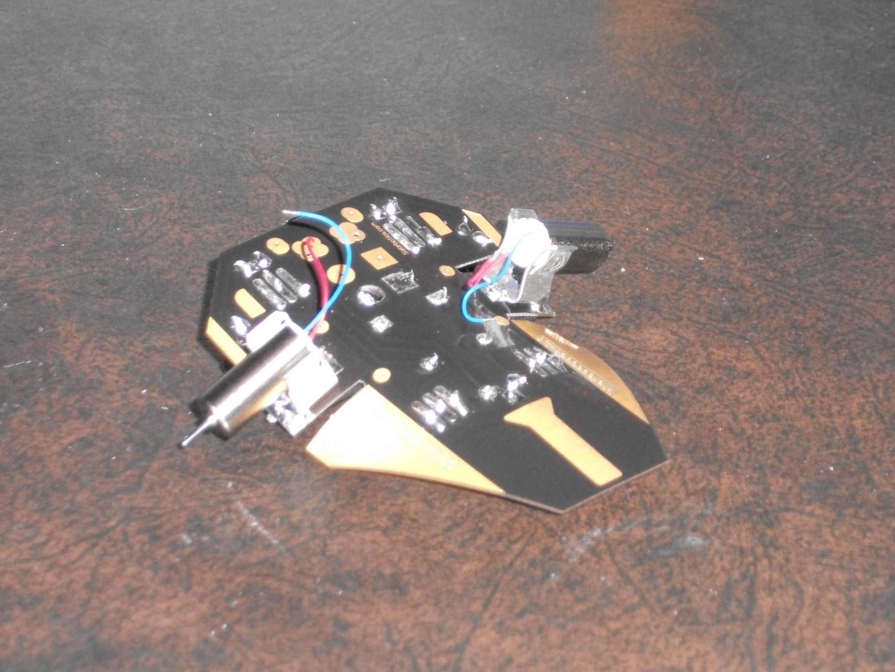</a>

  

    The motor mounts with motors soldered on
  

The next component to go on was the large storage capacitor, which had to have its leads bent 90 degrees so that it could lie flat against the PCB. The motor mounts were also fairly easy to attach, using a combination of folding tabs and plenty of solder. Once attached, the motors themselves simply clipped into place.

  <a href="dscf2780.jpg">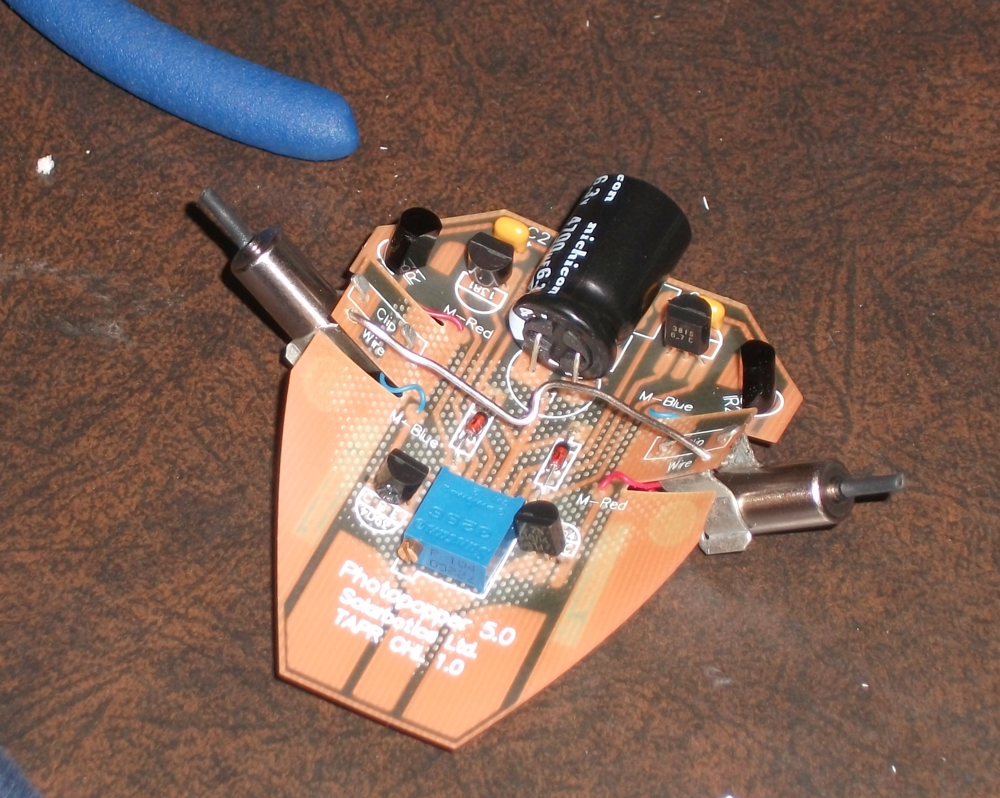</a>

  

    The support wire: Murphy&#8217;s Law finally shows up.
  

Next, it was necessary to install the support wire to ensure the photopopper&#8217;s legs would reach the ground. Unfortunately this is where my problems began, since I failed to make sure the wire was short enough before I began soldering it on. While it is technically possible to fix this by twisting it to increase tension, I found the spring of the PCB itself was stronger than the wire and I had to constantly re-tighten it. Eventually metal fatigue occurred, and the poor wire broke. Luckily I had a paperclip of a similar gauge (seen in the picture to the left) which seemed to be much stronger, and was capable of withstanding the flex of the PCB. After this, some of the heat-shrink tubing was applied to the motor shafts to make the tires/feet, and the paperclip was given a small twist to make sure they reached the ground.

  <a href="dscf2777.jpg">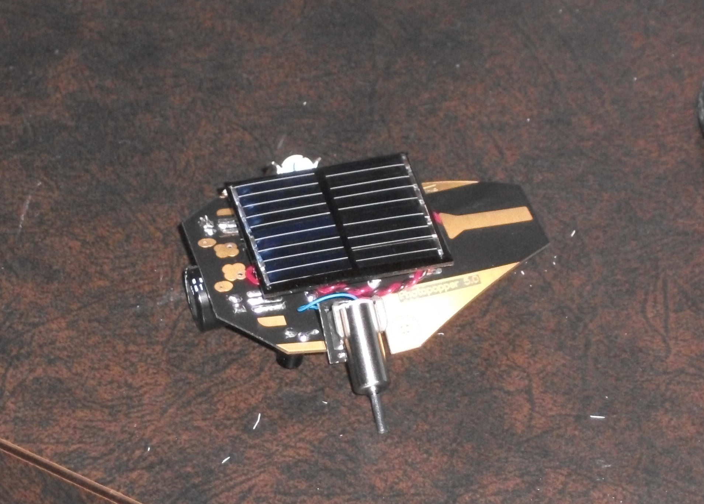</a>

  

    The solar panel is now attached
  

Attaching the solar cell was fairly easy, though wire strippers were needed to prepare the twisted red and black wire before it could be soldered to the right places. A piece of double sided sticky tape was then used to hold it into place. This was the next source of problems, because I mounted the solar panel before making sure each of the motors was working, and ruined it when I removed the panel to resolder one of the wires to the board. Luckily I had a replacement available, and I tested the conductivity of the adhesive before use to make sure it would not short anything. To best way to test each motor is to place the robot in direct sunlight or under an incandescent lightbulb, and then use something to short the square and circle pads on each side of the robot&#8217;s head (where the antennae will later be installed). From experience I recommend this step is performed before the solar panel is mounted. It is now a good idea to tune to robot, before the antenna are installed. To achieve this, the robot should be put near a source of light, and then the trimpot should be adjusted to make sure it moves towards that source, and doesn&#8217;t veer to either side. after this is achieved it is best to not to fiddle with it, as troubleshooting antennae and IR sensor balance at the same time was unnecessarily difficult.

  <a href="antennae.png">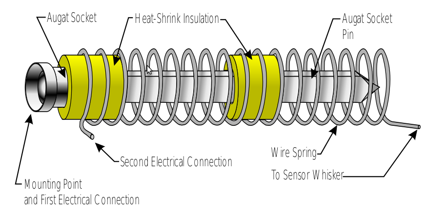</a>

  

    The structure of the tactile sensors
  

  <a href="dscf27821.jpg">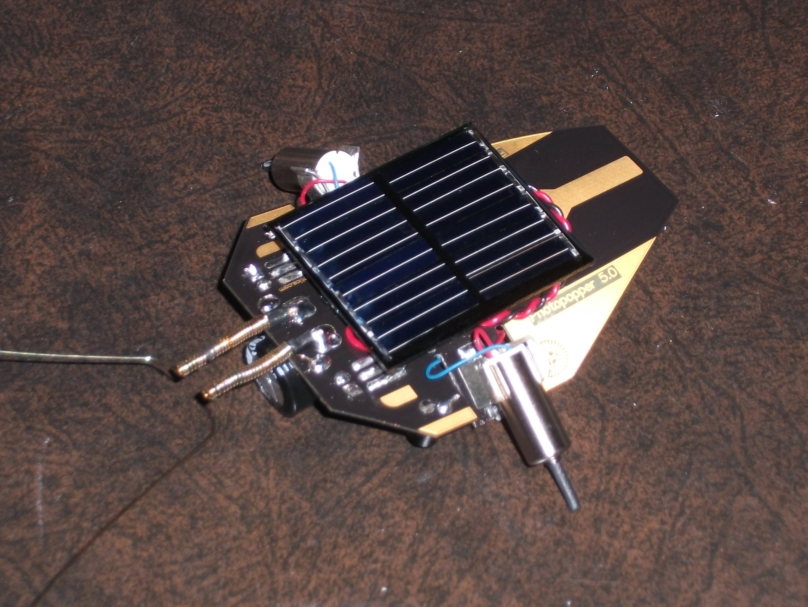</a>

  

    With the antennae installed
  

The idea behind the tactile sensors is that when they collide with something it causes the spring to bend and connect with the central pin. This shorts the circuit and bypasses the IR sensor to make sure the robot moves away from obstacles. This step was especially troublesome, since the heat shrink tubing didn&#8217;t contract enough, and the spring would not fit without significant forcing. Through a combination of slightly untwisting the spring to increase its diameter, forcing the tubing through with a screwdriver, and applying excessive force (enough to bend the pin), the spring was eventually moved into place. The antennae were then ready to be soldered on, with the wire from the spring connecting with one pad, and the base of the pin onto the other pad. Because the pins were bent from the previous step, a fair amount of adjustment had to be performed to ensure the short only occurred when the sensors were triggered. The antennae alone took at least as long as the rest of the assembly combined.

  <a href="dscf2801.jpg">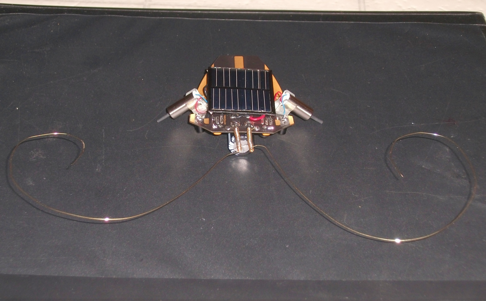</a>

  

    The finished Photopopper with curled antennae
  

After a fair amount of testing, I found that the antennae worked best when curled around, otherwise they would often spring past an obstacle, and fail to provide continued avoidance behaviour.

The last issue with this kit is that the solar panel it uses works extremely well in direct sunlight, but for us Canadians direct sunlight is in short supply this time of year. The alternative is to use an incandescent light bulb (florescent and halogen bulbs wont work), but these days incandescent lightbulbs are not so common. Luckily I was able to find an old desk lamp and incandescent bulb to use for testing and tuning. The video below shows some of this testing, in which the robot turns around to face the light source, then moves forward a short distance. This process slowly repeats itself. Obstacle avoidance is harder to fine tune, as the antennae often get stuck in the shorted position if mishandled. The problem of antennae springing past obstacles and not providing persistent avoidance still exists after they have been curled, though it&#8217;s less common.

Despite the issues encountered, this kit was very fun, and it was a great way to test out a new soldering iron. That being said; from start to finish it took much longer than the 2 hours they estimate in the instruction manual, and I can only imagine how difficult it would be with a cheap &#8220;fire starter&#8221; stick iron.
