+++
title = "Beaglebone: Making a Case"
description = "A home made cardboard case for my new BeagleBone single board computer."
date = 2012-05-13T13:41:34+00:00
authors = ["Everett Robinson"]
aliases = ["/2012/05/13/beaglebone-making-a-case/"]

[taxonomies]
tags = ["BeagleBone", "Electronics", "case", "DIY", "Recyling"]

[extra]
feature_image = "dscf3155.jpg"
+++

[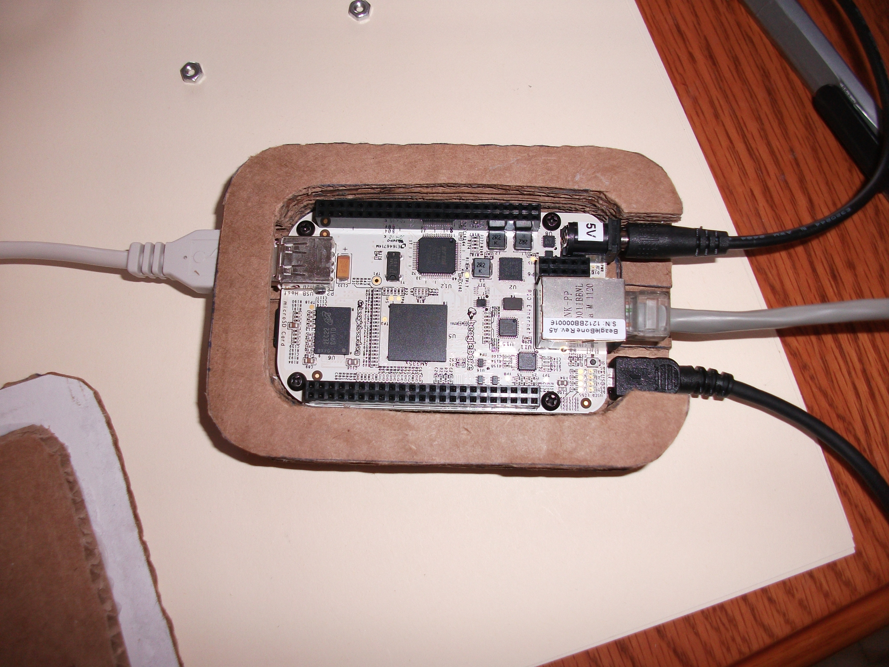](dscf3155.jpg)

I recently purchased a [BeagleBone](http://beagleboard.org/bone) with the intent of using it to make a home server and media box that could run constantly without costing a small fortune when the power bill arrived. I originally intended to make this project using a raspberry pi, though they&#8217;re having serious issues satisfying the demand, and I have other projects a raspberry pi can be put to use on that would make better use of its video capabilities.

The first thing I wanted to tackle when my BeagleBone arrived was creating some sort of enclosure. For those who&#8217;d rather shop than build, there are options available, though I&#8217;ve always been a more DIY kind of person. In regards to DIY BeagleBone cases, there are obvious solutions like an Altoids tin which the board fits into perfectly. This is not necessarily as simple as it seems though, since the Altoids tin can conduct electricity and could cause a short circuit if one isn&#8217;t careful. I considered this, and decided to pursue a different approach inspired by [these computers](http://www.recomputepc.com/). This had the added benefit of reusing the shipping box my BeagleBone arrived in, and effectively eliminates the risk of a short occurring. In summary; it is simply several layers of corrugated cardboard glued together with plain white glue, a set of self adhesive rubber feet, and some 1/2 inch 4-40 screws, nuts and nylon standoffs. At each step I also traced a rough template for that layer (seen below) which may be of use to anyone who wishes to replicate this project.

  

    <a href="beaglebone-case-template-print-at-95.png">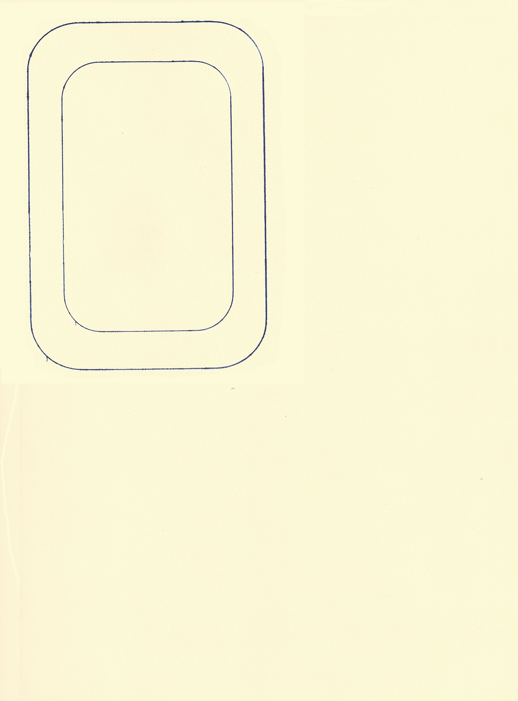</a>
    

      The Basic Template
    

  

  

    <a href="scan0081.jpg">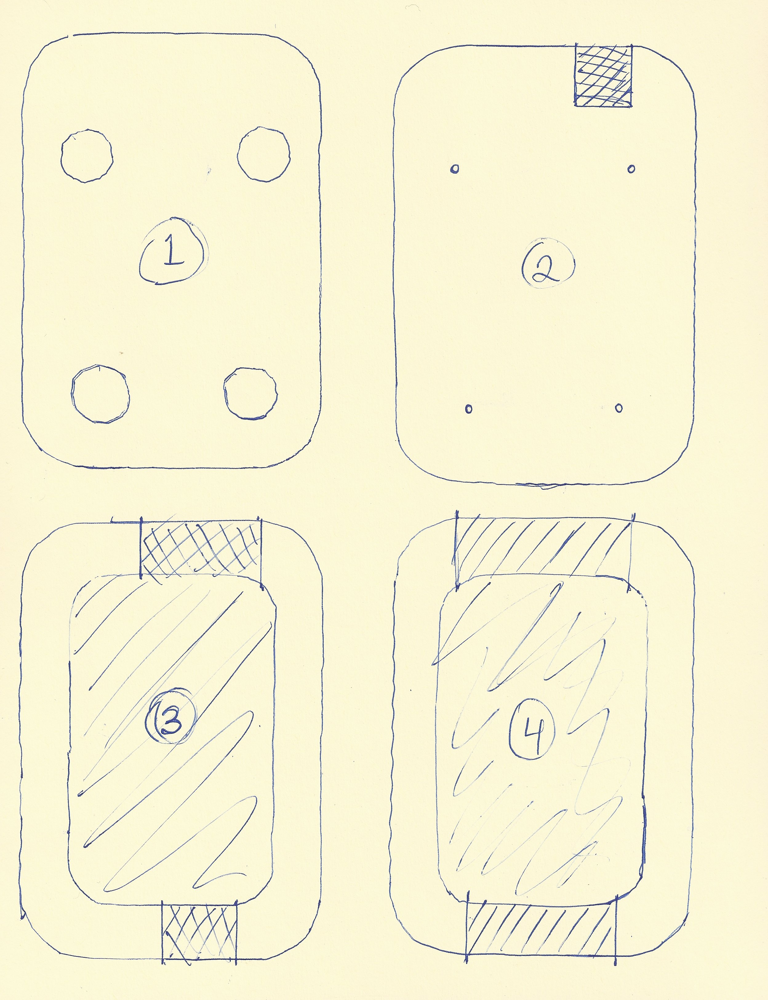</a>
    

      Rough guide for layers 1 &#8211; 4
    

  

  

    <a href="scan0082.jpg">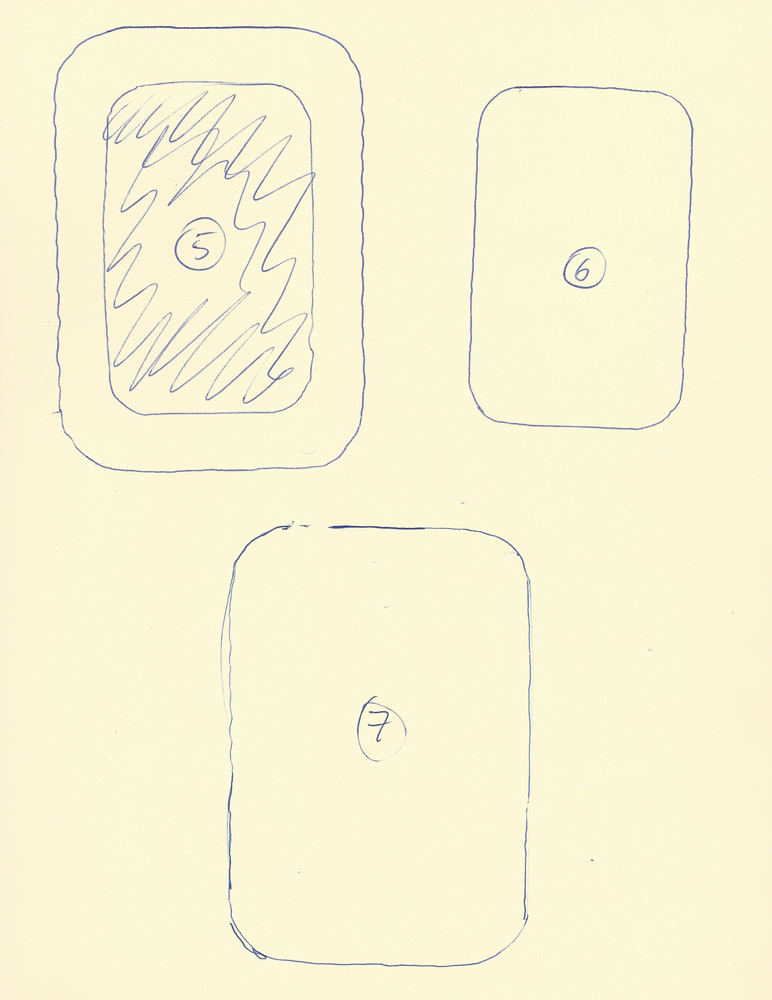</a>
    

      Rough guide for layers 5 &#8211; 7
    

  

  <a href="dscf3108.jpg">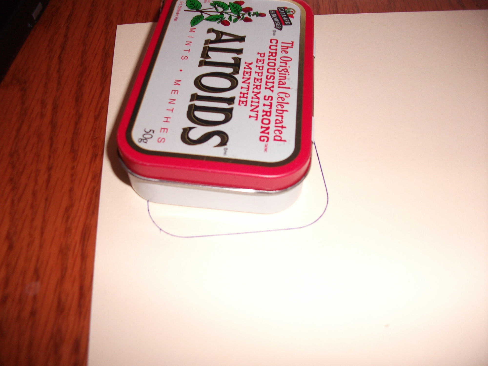</a>
  

    The beginning of my template
  

  I started by cutting the shipping box into several pieces for each of the layers in the case. I used the outline of an Altoids tin as the basis of my template since I knew the BeagleBone would fit snugly within that. This outline was scanned into my computer and modified it to create a general template with an inner area large enough for the BeagleBone.

  For the base we need two layers; the bottom piece with large holes cut which will accommodate the tips of the screws and the nuts, and the upper piece which has holes just large enough for the screws and a notch for the USB client. I did not realize this notch was necessary until after I had already glued these two pieces together, and had to cut it in with an Xacto knife after the fact.

  

    <a href="dscf3115.jpg">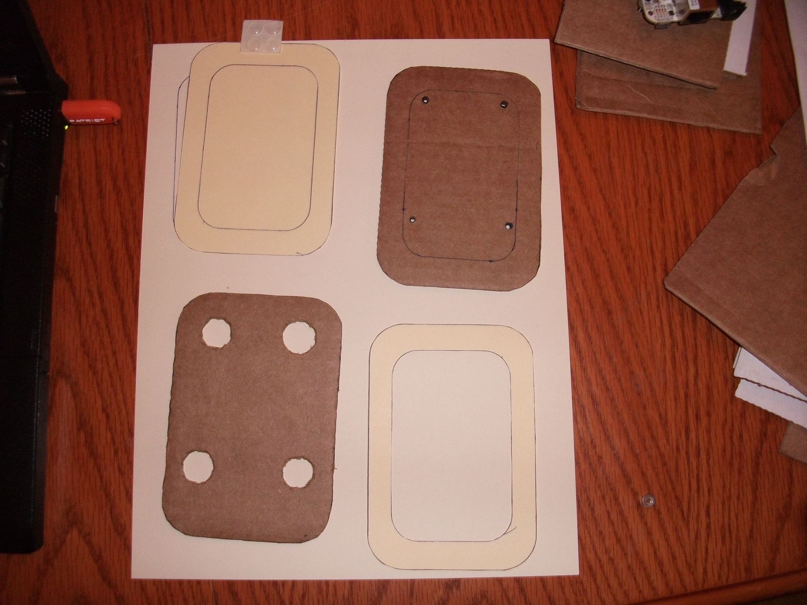</a>
    

      The two bottom most layers of the case, along with a couple template stencils.
    

  

  

    <a href="dscf3125.jpg">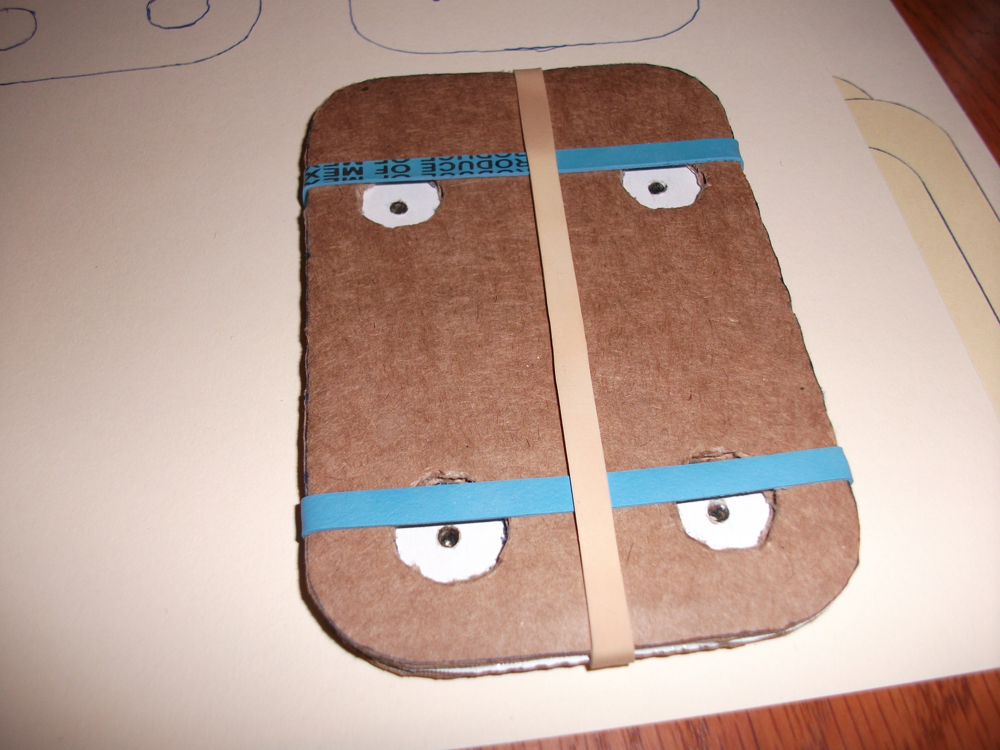</a>
    

      Letting the glue set
    

  

To make the upper layer, I used my base template to trace both the outlines onto the cardboard, but did not cut out the inner area. Instead I centred the BeagleBone in the centre with the screws and nylon standoffs attached and firmly pressed down on the screws until they made light indentations on the cardboard. Using a nail with the same approximate diameter as the screws I then punched holes into the cardboard at these points so that the computer could be firmly attached when the case was finished.

Next, it was necessary to glue these two pieces together, which was accomplished with a judicious amount of white glue (the kind you&#8217;ve probably used in elementary school). Once the glue became tacky, I wrapped a few elastic bands around them to keep them firmly pressed together and left them to dry for about half an hour.

  

    <a href="dscf3126.jpg">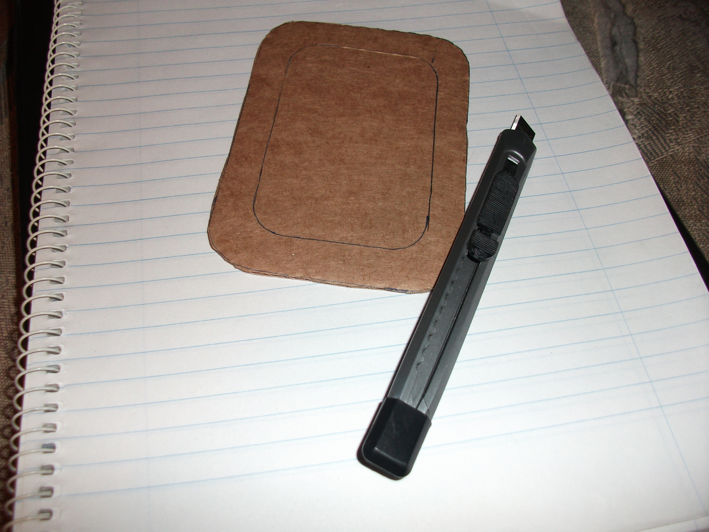</a>
    

      Cutting out the next set of layers
    

  

  

    <a href="dscf3127.jpg">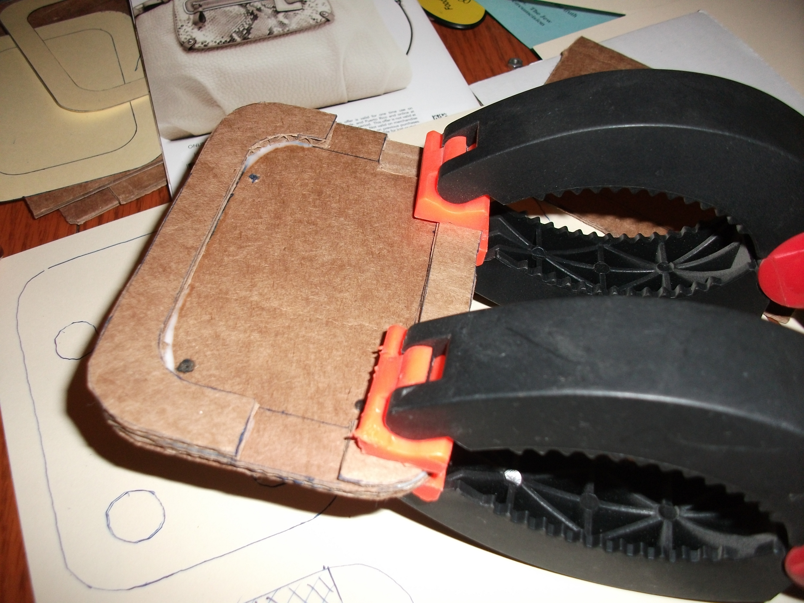</a>
    

      Building up the walls of the case
    

  

  While the glue set, I went to work cutting out several pieces for the remaining layers, which were all derived from the base template with the inner area also removed. To remove the centres, I simply used the Xacto knife again with extra care around the rounded corners. I then cut out portions of these to make layers 3 and 4. Only one copy of the 3rd layer was necessary, while layer 4 needed to be repeated several times (the number of times will depend on the thickness of the cardboard used).

  Like the two base layers, each of these remaining layers was glued to the base one at a time and the glue was allowed to set before the next layer was added. A set of plastic clamps were used because these layers have significant portions cut out it is not possible to use the elastic bands to hold them in place. This process should be repeated until the walls of the case come high enough to clear the Ethernet port on the BeagleBone.

  

    <a href="dscf3140.jpg">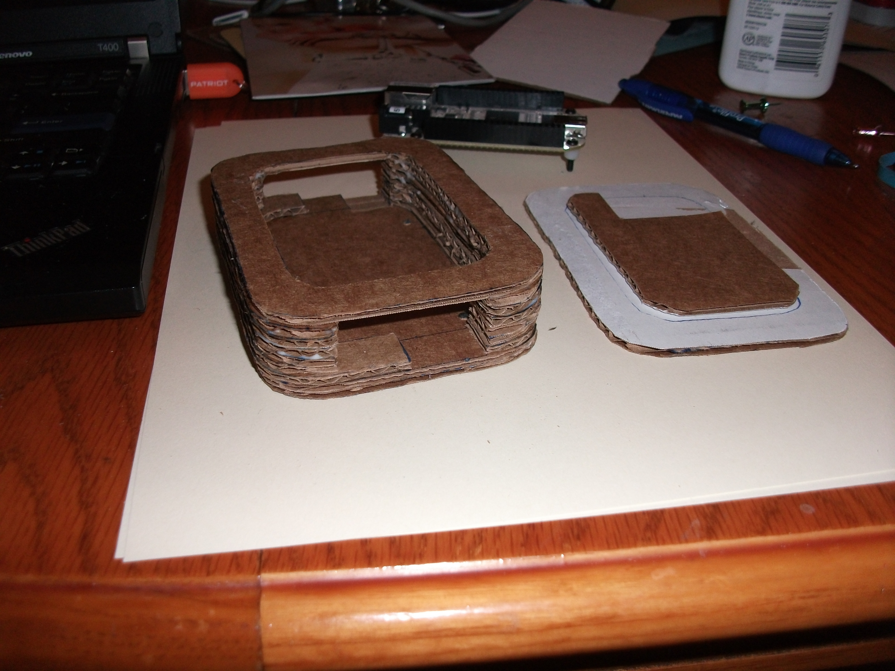</a>
    

      The case with the fifth layer added
    

  

  

    <a href="dscf3163.jpg">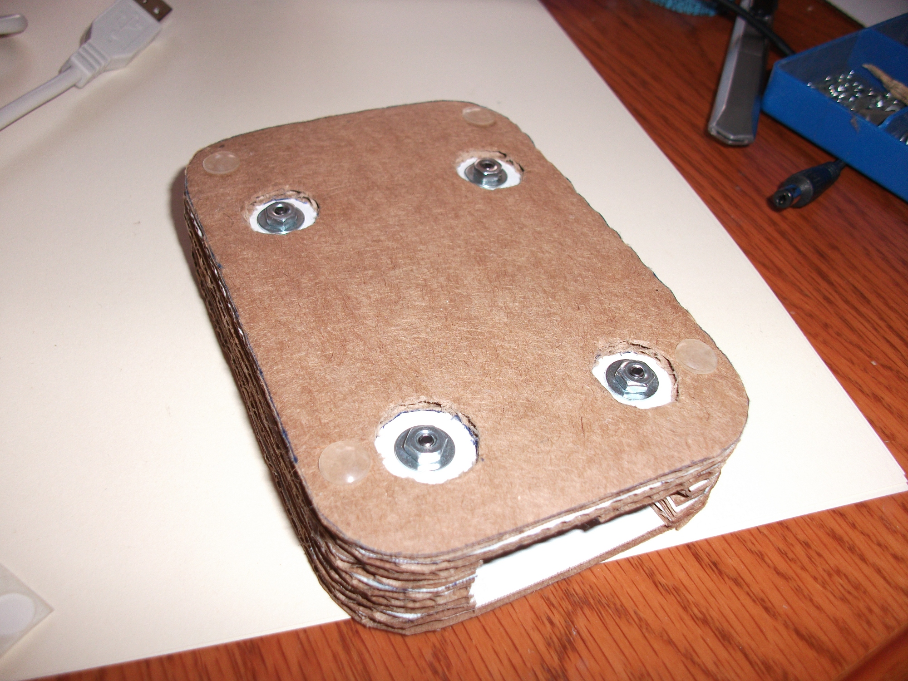</a>
    

      Some basic hardware holds the board firmly in place.
    

  

  After all this had been accomplished it was necessary to add a copy of the fifth layer to the top, which was simply one of the pieces I cut out earlier without any modifications. In my haste I neglected to double check that the walls of my case were high enough, and the fifth layer did not quite clear the Ethernet jack. I fixed this by cutting out the portion of layer 5 that stretched across the open area for these ports. This modification of the case can be seen in the image at the top of this post. It was also necessary to create a lid for the case, which was made by gluing together one copy of layer 6 and one of layer 7. I also had to cut a notch out of layer 6 to accommodate the Ethernet jack. If the correct number of copies of layer 4 are added, these modifications should be unnecessary.

  

  After finishing the case the last step was to firmly attach the BeagleBone to it using the nuts and washers. The nuts should be gently hand tightened so that they will not come undone while at the same time not crushing or damaging the cardboard where they connect. At this time I also added the rubber feet to the bottom of the case so that it would lift the cardboard off the surface and prevent it from sliding around.

  Below are several images of the finished case, including a little bit of decoration I added to the lid a couple days later. I made it using a stencil based on <a href="https://upload.wikimedia.org/wikipedia/commons/7/7b/Recycling_symbol.svg">this image</a>, which I simply shaded in using a green felt marker. At the end of it all The case is not the most beautiful or elegant way to house a BeagleBone, though the fun I had designing and making it myself all while recycling the packing material makes up for that in strides. I also enjoy the texture the corrugated cardboard gives to the case, which is best seen in the profile view below. Lastly, the ease with which it can be decorated and customized to your liking is definitely another nice touch. All things considered, I am extremely pleased with how this project turned out.

  

    <a href="dscf3146.jpg">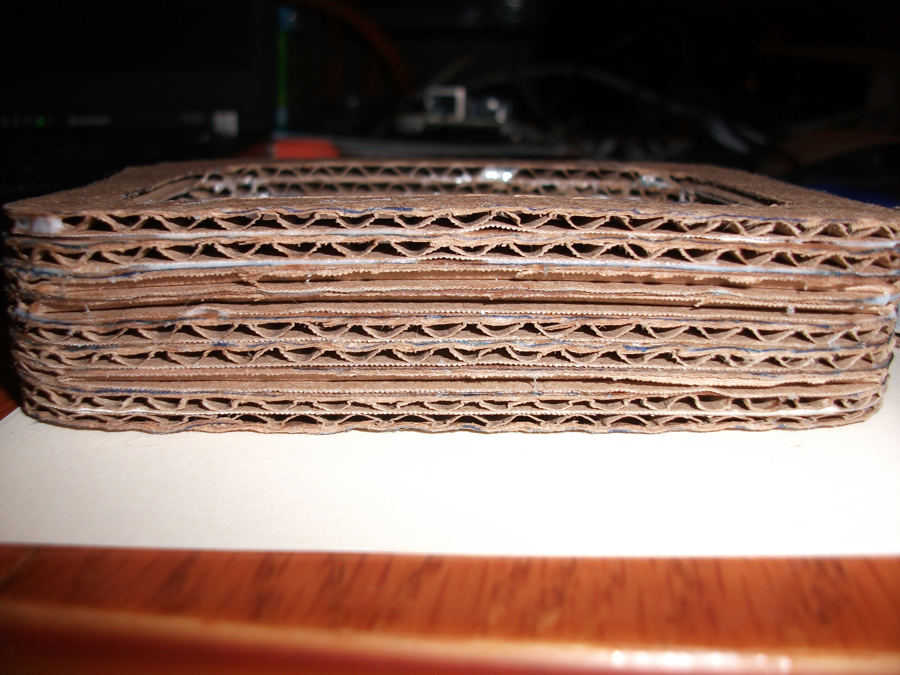</a>
    

      A side profile of the case
    

  

  

    <a href="dscf3157.jpg">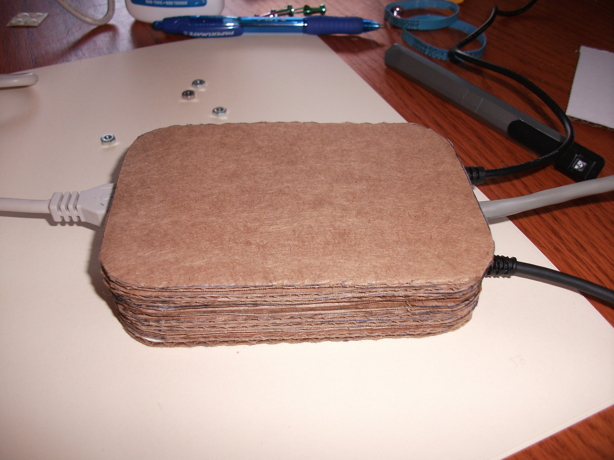</a>
    

      With the lid on
    

  

  

    <a href="dscf3168.jpg">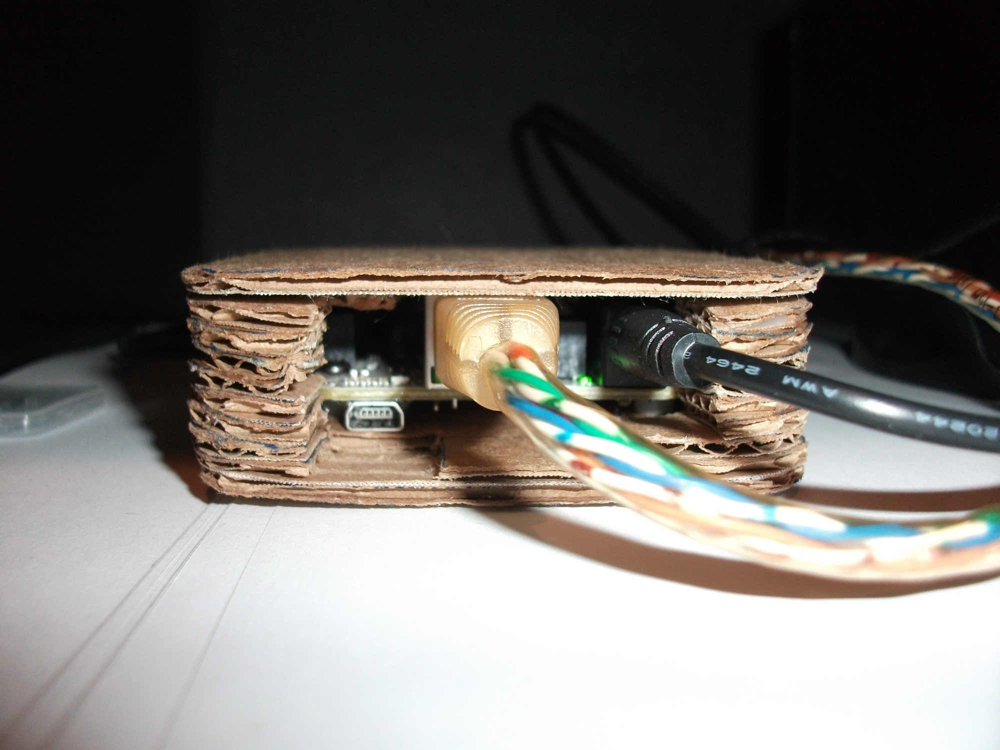</a>
    

      The case and board in action
    

  

  

    <a href="dscf3175.jpg">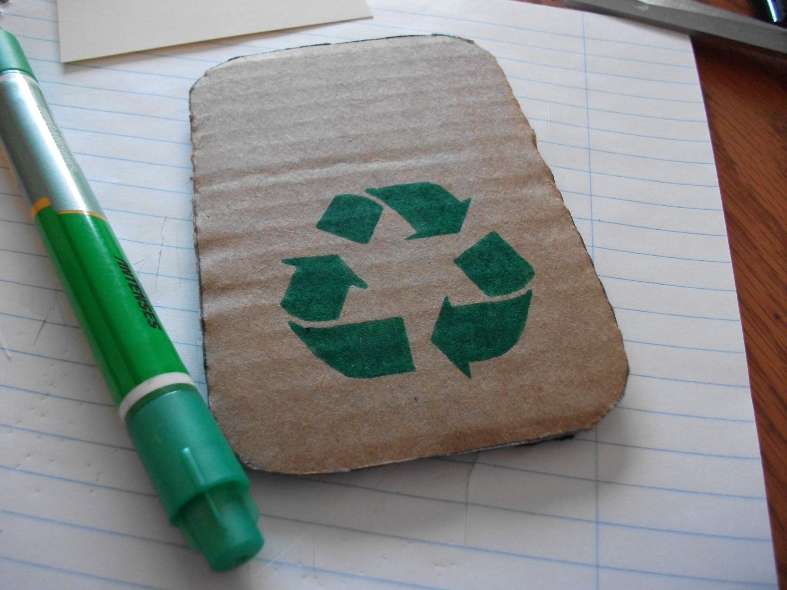</a>
    

      Decorative elements can be added too
    

  

