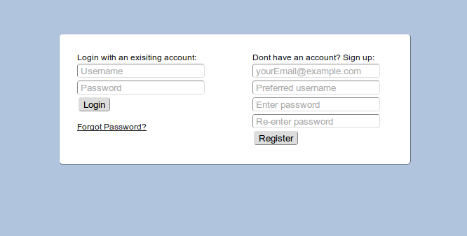
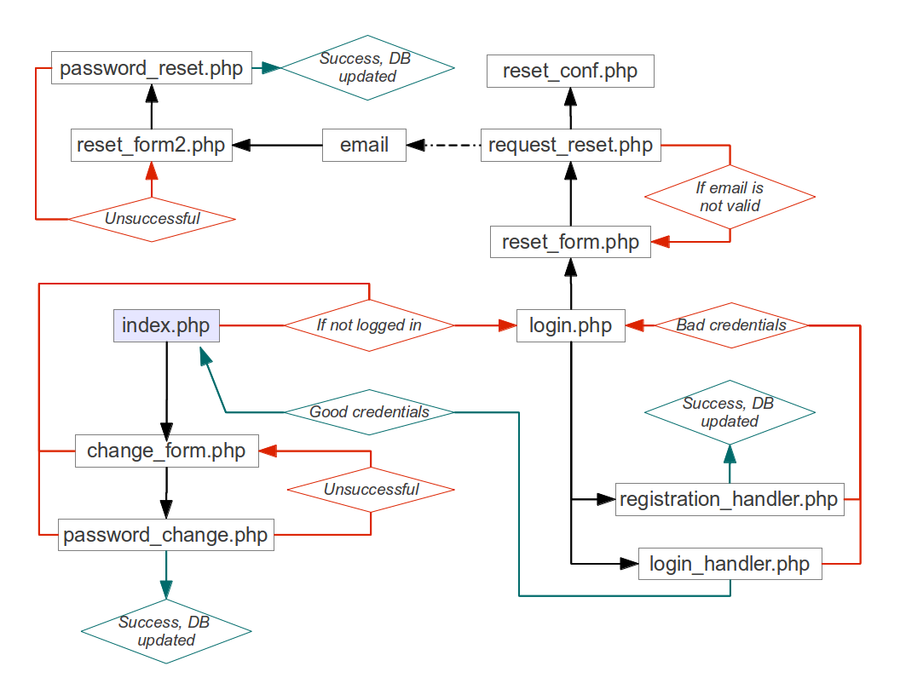

+++
title = "Designing a secure(ish) login script with PHP and MySQL"
description = "Learning the basics of data bases and password hashing using PHP by re-inventing the login script."
date = 2013-02-17T13:53:15Z
authors = ["Everett Robinson"]
aliases = ["/2013/02/17/designing-a-secureish-login-script-with-php-and-mysql/"]

[taxonomies]
tags = [ "CSS3", "HTTP", "MySQL", "PHP", "Programming", "Web Applications", "Web Design", "Web Development", "Web Server", "login script", "software", "web",]

[extra]
feature_image = "login.png"
+++

  <a href="/phplogin/phpLogin.zip">If you want the source code right away, click here.</a>

This project has taken me much longer to complete than I originally expected it would. I guess I just wanted to make sure that it functioned in a sane and relatively secure manner. I usually don&#8217;t feel compelled to reinvent the wheel, but I wanted a good project that I could use to learn PHP and MySQL, and a login script turns out to be a solid project which incorporates all of that. I set out to make sure my login script wasn&#8217;t a piece of junk by design, which means that I did a little research to make sure I wasn&#8217;t doing anything inherently insecure. This doesn&#8217;t mean that it is secure, and I really wouldn&#8217;t recommend using my scripts in an actual project, since they are not rigorously tested. Furthermore, because I am too cheap to pay for a proper webhost, my site has no SSL certificate and hence no HTTPS, which is a major security hole. If someone happened to eavesdrop on your connection they could easily steal your session or your password. For this reason, it is a good idea to not register on my example page using credentials that you&#8217;ve used in other places. This is also why I decided to call my project secureish in the title. Regardless of these potential issues, I am pleased with the final result, which incorporates all of the following:

### Principles:

  * Never store passwords in plaintext
  * Store DB login credentials in a config file to be required when needed
  * Don&#8217;t send passwords in plain sight: Use POST instead of GET so that they&#8217;re not in the URL
  * Use a secure hashing algorithm and always use salt
      * bcrypt/blowfish
  * Secure from SQL injection by sanitizating user input via prepare with _PHP Data Objects_ (PDO)
      * Use PDO instead of MySQL extension which is supposed to be deprecated eventually
  * Incorporate session control
  * Change Password option
  * A means of recovering the account with a one time use URL sent to email the account was registered with
      * Expires after a short period
      * Expires after use
  * Have forms return meaningful error messages if input is not valid
  * Preserve data that a user has entered into a form in the event an issue occurs during registration. Having to re-enter the entire form always sucks
  * Make the forms and pages look vaguely modern: not something that passed off as okay in 1996.
      * Placeholders.js is used to make the placeholder attributes work in older or useless browsers like Internet Explorer.

### Features it could have, but I didn&#8217;t bother implementing:

  * Email verification of account to prevent lots of spam accounts from cluttering up the users table in the database
  * JavaScript mechanism to tell the user in real time if their username or email is already taken right on the registration form

### The code and how it works:

If you just want the source code, [I have them all zipped up and ready to go](/phplogin/phpLogin.zip). The config.inc.php and request_reset.php files will need to be updated with your own site specific information, such as base URLs and database login credentials.

Because it would take a lot of words to describe the interactions between all of the files, I&#8217;ve decided to condense that information into a flow chart. The index.php page is assumed to be the starting point and coloured blue to reflect this.

I have left a few of the files out of the flow chart so it didn&#8217;t get too busy. These are the config.inc.php which stores the credentials necessary to access the database, the logout.php page, and the cron_purge.php file which removes time expired password reset tokens from the table that contains them. I have the cron job set up to run every hour.

Normally I would use the source code tags to post my code directly on this blog, but there are a lot of files required to make this work, and I feel that posting the source code for each one of them directly to this blog with the source code tags will be far too cluttered. Hopefully it isn&#8217;t any great inconvenience to download the zip file containing all of the code, and if it is then you have my apologies.

Once you have all of the files, it is necessary to set up the MySQL database. I am assuming your server or webhost already has this installed and that a database user has already been created. All we need to do in that case then, is create our tables. There are two tables, the users table which stores emails, usernames, and password hashes, and the passwordReset table which manages the tokens used to reset a forgotten password.

To create the users table, enter the following query using phpMyAdmin or an equivalent tool:

> CREATE TABLE \`users\` (
> \`id\` int(11) NOT NULL AUTO_INCREMENT,
> \`username\` varchar(32) NOT NULL,
> \`email\` varchar(254) NOT NULL,
> \`password_hash\` varchar(64) NOT NULL,
> PRIMARY KEY (\`id\`),
> UNIQUE KEY \`username\` (\`username\`),
> UNIQUE KEY \`email\` (\`email\`)
> ) ENGINE=MyISAM DEFAULT CHARSET=latin1

To create the passwordReset table, we simply enter this query the same way we did for the users table:

> CREATE TABLE \`passwordReset\` (
> \`userid\` int(11) NOT NULL,
> \`UUID\` varchar(32) NOT NULL,
> \`created\` timestamp NOT NULL DEFAULT CURRENT_TIMESTAMP,
> PRIMARY KEY (\`userid\`)
> ) ENGINE=MyISAM DEFAULT CHARSET=latin1

And that&#8217;s all there is too it. If you have those PHP files in a public directory of your web server and the tables created in MySQL,then you should be good to go.

Lastly, I&#8217;ve done my best to make this site look nice on a variety of browsers on multiple operating systems (Various combinations of Chrome, Firefox, Internet Explorer, and Opera on any one of Linux, Windows and Mac OS X for those who are interested), but consistency in rendering can be a real problem. I make no guarantees that it will look just right in any particular browser or operating system.
