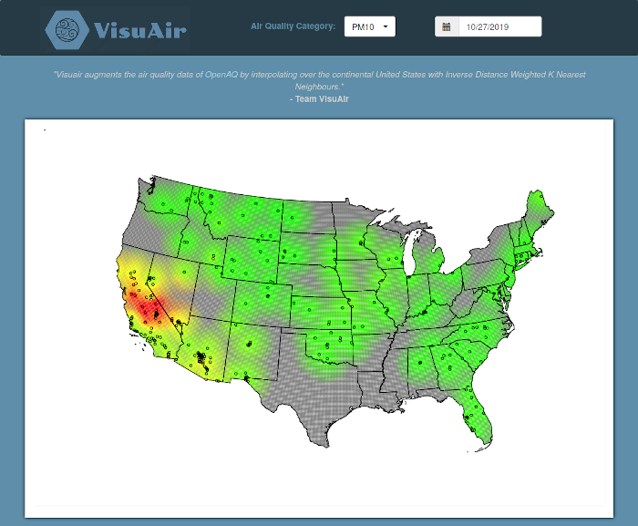
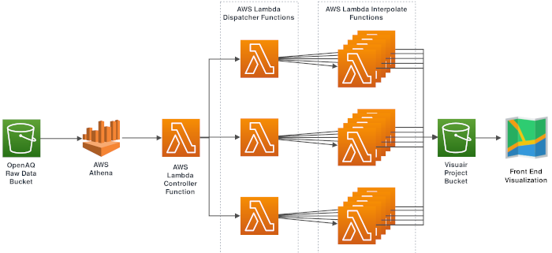

+++
title = "Visuair"
description = "A cloud based data analytics application for extrapolating air quality data. Completed for the Georgia Tech OMSA course CSE 6242 - Data and Visual Analytics."
date = "2019-12-26"
authors = [ "Everett Robinson",]
aliases = ["/2019/12/26/visuair.html"]

[taxonomies]
tags = ["Data Science", "Python", "Serverless", "AWS", "S3", "Lambda", "Athena", "D3.js"]

[extra]
layout = "post"
output = "html_document"
+++

[Visuair](http://visuair2.s3-website-us-east-1.amazonaws.com/) is a webapp with the goal of augmenting the OpenAQ data over the continental USA using the common IDW interpolation technique. It's a group project completed during the Fall 2019 semester for CSE 6242x in the Georgia Tech Masters of Science in Analytics with the help of my talented team mates Ben Kester, Dalton Fabian, Jacob Vander Ploeg, and Cameron Griser.

Our implementation touched a number of interesting technologies, including:
* [D3.js](https://d3js.org/) for visualizations
* [AWS S3](https://aws.amazon.com/s3/) for storage and hosting
* [AWS Athena](https://aws.amazon.com/athena/) for querying the OpenAQ data 
* [AWS Lambda](https://aws.amazon.com/lambda/) for computing the interpolations.

The front end is a simple html web page that uses jquery and D3 to plot pre-computed interpolations using the daily mean values of each air quality sensor. The user can explore the data by selecting their desired air quality parameter and date of interpolation. In order to communicate increasing uncertainty in the interpolation, we chose to decrease the colour saturation with increasing distance from the nearest sensor.

The back end uses Athena to directly query the [OpenAQ S3 Bucket](https://openaq-fetches.s3.amazonaws.com/index.html) and create the daily mean values for each sensor location. When executed initially, the interpolations need to be back computed for all existing parameters and measurement dates. To accomplish this a controller -> dispatcher -> interpolator lambda function architecture was created:

The project also runs this pipeline daily on only the most recent week of data. This allows it to continuously update, and to capture any changes in the data for up to a week after the recording was actually captured.

On an initial run the project needs to compute interpolations for more than 9500 parameter and date combinations, and the above architecture allows it to compute them all in less than five minutes with a cost of about \\$5 not including the lambda free tier credits. Daily updates and ongoing hosting is also very affordable, with current monthly costs remaining below \\$3.

More information about the project can be found in this [narrated poster presentation](https://www.youtube.com/watch?v=QflUNnPgxm4), prepared as a final deliverable for the course.