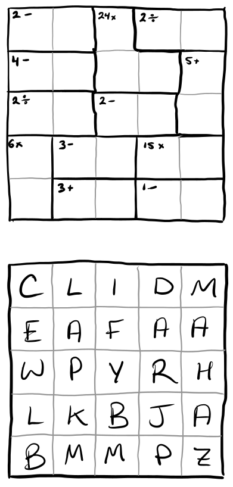
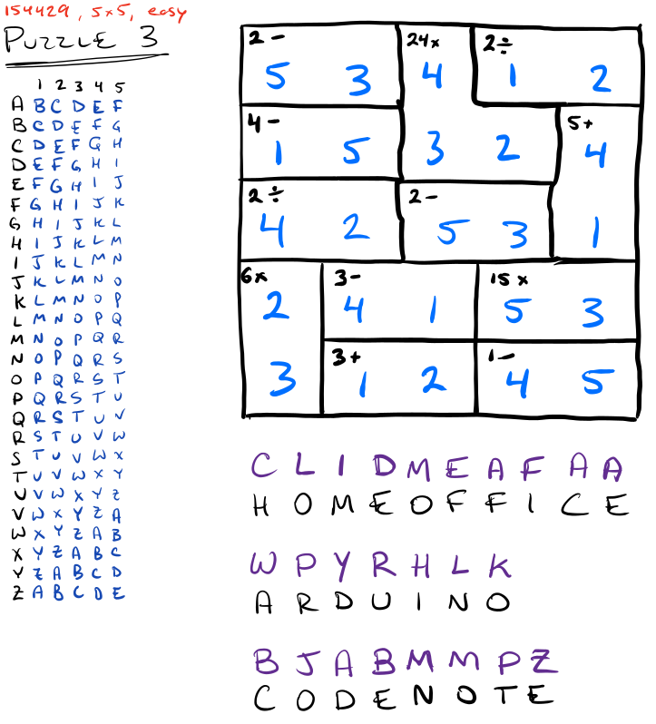
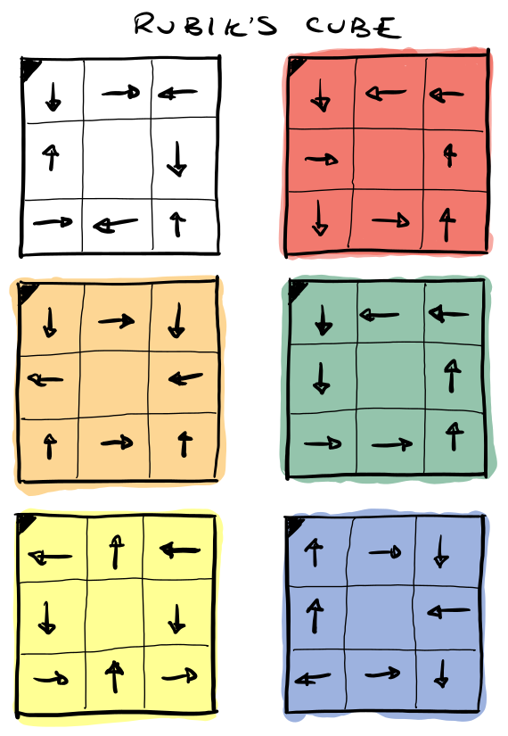
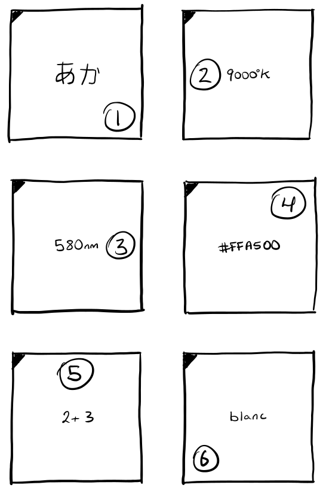
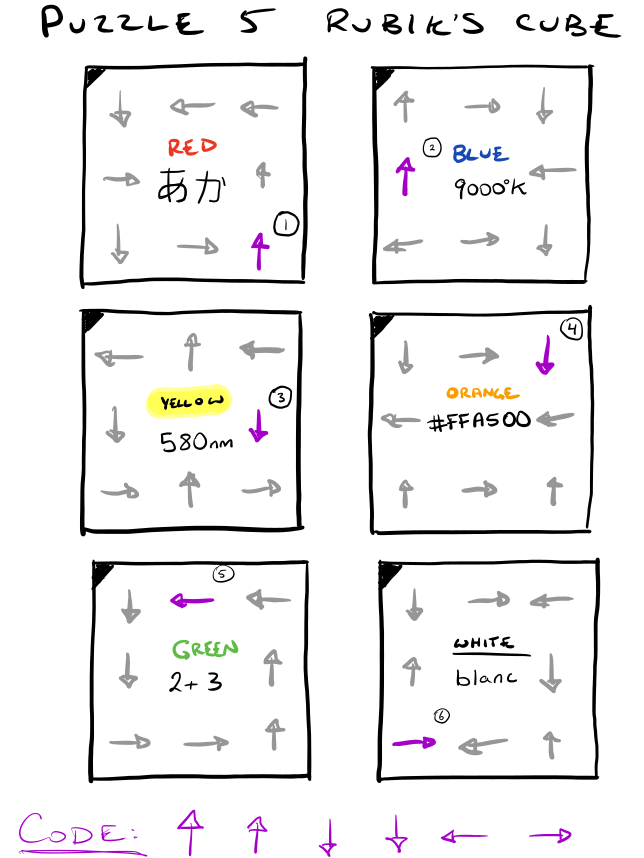

+++
title = "A Puzzling Proposal"
description = "The set of puzzles I designed and made my fiance solve to find the site of my marriage proposal. Can you solve them?"
date = "2020-05-29"
authors = [ "Everett Robinson",]
aliases = ["/2020/05/29/puzzling-proposal.html"]

[taxonomies]
tags = ["Proposal", "Puzzles", "Arduino"]

[extra]
layout = "post"
output = "html_document"
+++

Back in September 2019 I proposed to my girlfiend of three and a half years! She said yes. I have no idea why, because I literally made her and her best friend solve a series of puzzles just to find me. I'm glad she didn't give up, and wasn't fed up with me by the end of it. Without further delay, here is a subset of the most interesting puzzles:

### Puzzle 1

You're presented with a small box containing:

* M&Ms: 1 Brown, 2 Blue, 3 Yellow, 4 Red, 5 Green, and 6 Orange ones.
* A URL: <a href='http://everettsprojects.com/8543W/mandms/'>http://everettsprojects.com/8543W/mandms/</a>
* A note: "Hmm... I can't remember the code. I think it started with blue? No that's not right... Oh well, there's only 7,776 combinations!"

<button class="collapsible" id="puzzle1">Click here to see the solution.</button>

  

    The puzzle is a simple clone of the game Mastermind. The colors are a bit of a red herring, with the varying numbers meant to make you think about using digits. The cheeky note is only there to encourage experimentation. The solution to the mastermind puzzle is 24261. Blue Red Blue Orange Brown. But you figured that out on your own, right?`
  

  

    In the next stage the three words are a what3words address. The lion's den is the home of my sister, a co-conspirator, and the lion is her cat Leo. The next puzzle is waiting.
  

### Puzzle 2

You arrive at the next puzzle to find only this:

<button class="collapsible" id="puzzle2">Click here to see the solution.</button>

  

    It's a KenKen puzzle which is then used as a one time pad to decode the text: "Home Office Arduino Code NOTE":
  

  
  

    You know where to go.
  

### Puzzle 3

You find a box with a letter combination lock. It opens with the code "NOTE" and you find an arduino:

<iframe width="725" height="453" src="https://www.tinkercad.com/embed/jJDQAT2PAjE" frameborder="0" marginwidth="0" marginheight="0" scrolling="no"></iframe>

 
There is also another URL: <a href='http://everettsprojects.com/8543W/song-time/'>http://everettsprojects.com/8543W/song-time/</a>

Nothing more is provided.

<button class="collapsible" id="puzzle3">Click here to see the solution.</button>

  

    You might recognize the melody as the Song of Time from the Legend of Zelda: Ocarina of Time. If you play the corresponding notes <strong>"A,D,F,A,D,F,A,C,B,G,F,G,A,D,C,E,D"</strong> without errors and press submit you are told the location of the next clue lies with my family dog Bozley and receive another code word: MUTT.
  

### Puzzle 4

You find two locked boxes. The first has a direction lock. The second expects a four letter code and the word MUTT opens it. Inside you find:

1.) A Rubik's cube covered in arrows. It didn't come pre-solved, so you could solve one before proceeding if you would like the full experience:

2.) The following diagram:

<button class="collapsible" id="puzzle4">Click here to see the solution.</button>

  

    The codes on the diagram are different ways of expressing colors:
      <ul>
        <li>あか: Japanese for Red</li>
        <li>9000K: The color temperature of Blue</li>
        <li>580nm: The wavelength of Yellow</li>
        <li>#FFA500: Hexadecimal RGB for Orange</li>
        <li>2 + 3: Blue + Yellow = Green</li>
        <li>blanc: French for White</li>
      </ul>  
    Matching the colors to the faces of the Rubik's cube and then choosing the arrows located in the same square in order of the circled numbers gives the code: Up Up Down Down Left Right.
  

  
  

    This code opens the direction lock and inside you find a <a href='https://www.youtube.com/watch?v=VIVIegSt81k'>hexahexaflexagon</a>. On the the many faces of the hexahexaflexagon is the location of the proposal site where I have been patiently waiting.
  

