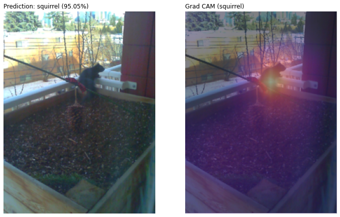

+++
title = "Birb Cam Grad-CAM"
description = "Gaining insight into what the Birb Cam Sees with Grad-CAM"
date = "2021-02-15"
authors = [ "Everett Robinson",]
aliases = ["/2021/02/15/birbcam-grad-cam.html"]

[taxonomies]
tags = ["Data Science", "Python", "Computer Vision", "Fast.ai"]

[extra]
layout = "post"
output = "html_document"
+++

Much of North America has been in a polar vortex for the past couple of weeks, bringing cold weather and lots of wind. These weather conditions have caused furnaces to work overtime, including the apartment building across the street. The exhaust plumes are causing some havoc for the Birb Cam, making the change detection go a bit crazy.

[](furnace_exhaust.webp)

The recent weather patterns and lighting conditions also cause trouble for the classification model, making it predict chickadee when no critters are present. These misclassifications happen infrequently, but more than I anecdotally recall from before. Images like these have something in particular that makes them very chickadee like to the neural network:

[](2021-02-08T10:56:58_chickadee.jpg)


We don't need to guess at random why the model thinks these images are chickadees, though; we can get insight using a tool for evaluating post hoc model attention such as Grad-CAM (Gradient Class Activation Maps). In plain English, this means interrogating the model to explain what regions of the input image were the most important to making its classification decision. Using Grad-CAM with the Bird Cam model is very easy in Fast.ai thanks to the callback mechanisms built-in. Jeremy Howard and Sylvain Gugger devote an [entire chapter of their book to Class Activation Maps](https://github.com/fastai/fastbook/blob/master/18_CAM.ipynb) to demonstrate the utility of these callbacks. It was this chapter that inspired me to use Grad-CAM and rework their code into the following classes and function:

```python
learn = load_learner(path/'models/birbcam_prod.pkl')

class Hook():
    def __init__(self, m):
        self.hook = m.register_forward_hook(self.hook_func)
    def hook_func(self, m, i, o):
        self.stored = o.detach().clone()
    def __enter__(self, *args):
        return self
    def __exit__(self, *args):
        self.hook.remove()

class HookBwd():
    def __init__(self, m):
        self.hook = m.register_backward_hook(self.hook_func)
    def hook_func(self, m, gi, go):
        self.stored = go[0].detach().clone()
    def __enter__(self, *args):
        return self
    def __exit__(self, *args):
        self.hook.remove()

def grad_cam_plot(img, cls, conv_layer=-1):
    with HookBwd(learn.model[0][conv_layer]) as hookg:
        with Hook(learn.model[0][conv_layer]) as hook:
            x, = first(dls.test_dl([img]))
            output = learn.model.eval()(x.cpu())
            act = hook.stored
        output[0, cls].backward()
        grad = hookg.stored
    w = grad[0].mean(dim=[1,2], keepdim=True)
    gcam = (w * act[0]).sum(0)
    x_dec = TensorImage(dls.train.decode((x,))[0][0])
    _, axs = plt.subplots(1,2)
    x_dec.show(ctx=axs[0])
    x_dec.show(ctx=axs[1])
    y = learn.predict(img)
    cam_label = learn.dls.vocab[cls]
    axs[1].imshow(gcam.detach().cpu(), alpha=0.5, 
                  extent=(0,240,320,0), interpolation='bilinear',
                  cmap='magma')
    pred = y[0]
    if pred == []:
        pred = 'none'
    else:
        confs = y[2].detach().numpy()
        confs = confs[y[1].detach().numpy()] * 100
        confs = confs.tolist()
        prec = '.2f'
        confs = [f'{c:{prec}}%' for c in confs]
        pred = ','.join(pred) + ' (' + ','.join(confs) + ')'
    title = f'Prediction: {pred}'
    axs[0].set_title(title, loc='left')
    axs[1].set_title(f'Grad CAM ({cam_label})', loc='left')

```

Applied to correctly classified Birb Cam images, it looks like this:

[](grad-cam-chickadee.png)

[](grad-cam-sparrow.png)

[](grad-cam-squirrel-2.png)

Grad-CAM consistently identifies a region of importance on top of and immediately surrounding the critter. It highlights other portions of the image in lighter shades of magenta, indicating it hasn't perfectly localized the target animal, but all in all, it appears to have the gist.  When applied to the misclassified images, we get the following:

[](grad-cam-chickadee-misclass-1.png)

[](grad-cam-chickadee-misclass-2.png)

It appears that the patchy pattern of soil and snow in the lower portion of the planter box has a chickadee like quality, which makes a lot of sense given it has the same contrast as the black caps of the birds. The partially obscured garbage truck driving by and the apartment across the street also seem to have chickadee like qualities. It's not as clear to me why this should be the case. Perhaps the model is mistaking the yellow of the logo on the truck's side and the apartment's brickwork for the chickadee's breast feathers. These results also offer an excellent example of a quote I found by Rachel Lea Ballantyne Draelos while working on this post: ["Explainability is not interpretability"](https://towardsdatascience.com/grad-cam-2f0c6f3807fe). While tools like Grad-CAM can point us toward the most relevant regions of the image for the classification decision, they don't tell us what it is about those regions that drive the decision. I'm the one that's speculating it's because of the black soil and white snow contrast or the yellowness of the brick and truck's logo. These are nothing more than informed guesses made to rationalize the class activation maps after the fact, and there are plenty of reasons why my rationalizations might be wrong.

