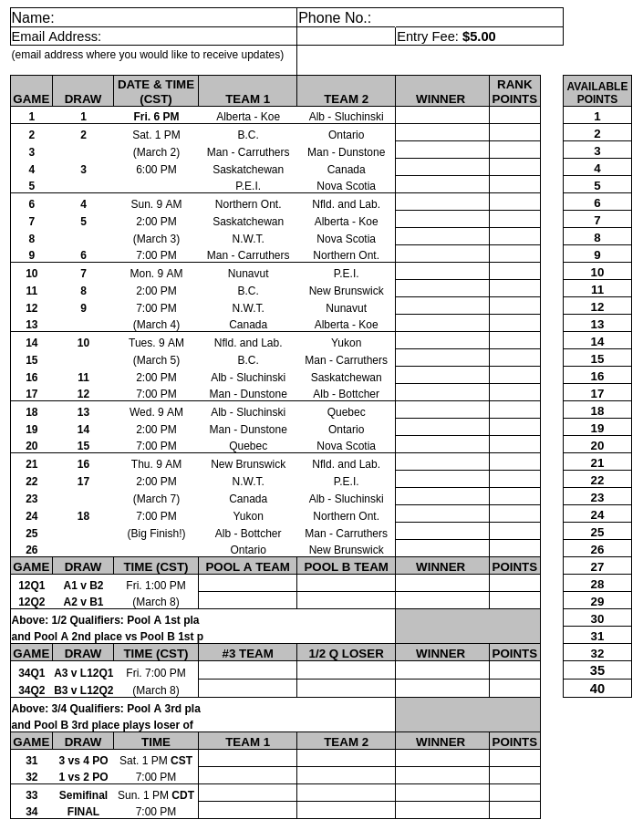
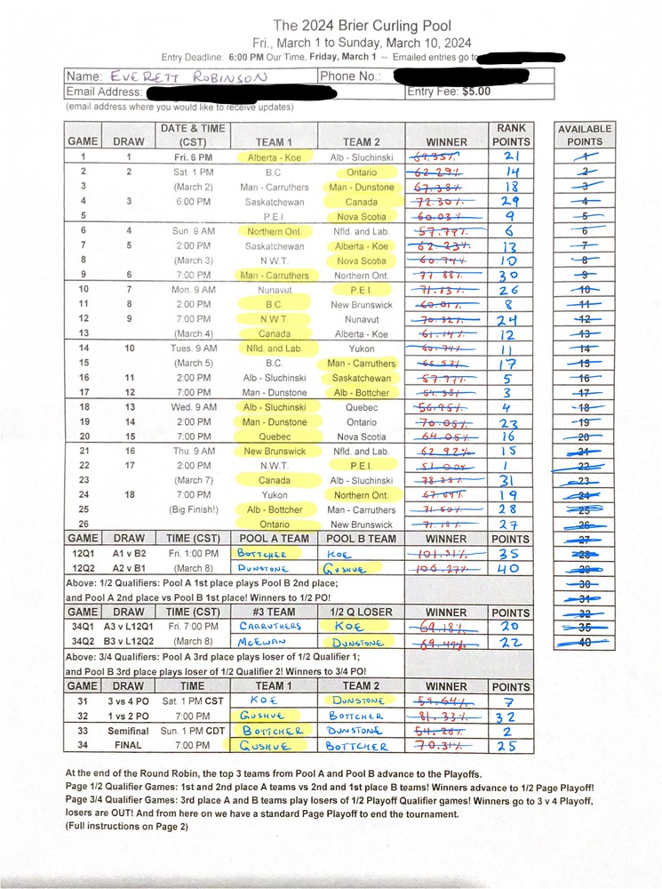

+++
title = "How to Simulate the Brier 10,000 Times and Still Lose"
description = "Using data to try and win my first sports pool"
date = "2024-03-11"
authors = [ "Everett Robinson",]
aliases = ["/2024/03/11/brier-pool.html"]

[taxonomies]
tags = ["Data Science", "Python", "Statistics", "Simulation", "Curling", "Brier", "Sports"]

[extra]
layout = "post"
output = "html_document"
+++

Over the past year I've been very excited about curling. My wife and I took the sport up as a winter activity in 2022 after moving to Manitoba. While that first season was enjoyable, we faced a lot of distractions from other life events that meant it was hard to appreciate that time on the ice. This year has been totally different, and my excitement for playing the game has bled over into watching the pro tournaments as well. So what do I do when a member of my club approached me about entering his Brier pool this year? You bet I'm entering that!


### The Entry Form

The Pool I entered consists of the following (paper!) entry form:



#### The Rules

On the back of this form, the rules are as follows:

```
At the end of the Round Robin, the top 3 teams from Pool A and Pool B advance to the Playoffs. 	  	  	 
Page 1/2 Qualifier Games: 1st and 2nd place A teams vs 2nd and 1st place B teams! Winners advance to 1/2 Page Playoff!
Page 3/4 Qualifier Games: 3rd place A and B teams play losers of 1/2 Playoff Qualifier games! Winners go to 3 v 4 Playoff,
losers are OUT! And from here on we have a standard Page Playoff to end the tournament. 	  	  	  	   	  	  	  	  	 
  	  	  	  	  	  	  	  	  	 
INSTRUCTIONS: Select the winner for every round robin game by putting each winning team name in the "WINNER" column. 	 
Pick the 1st and 2nd place A and B pool teams to play in the 1/2 Qualifier games above, and choose the winners. 	 
Pick the 3rd place A & B pool teams to play the losers of the 1/2 Qualifier games above, and choose those winners. 	 
And pick the teams you think you will play in the two Page playoff, Semifinal, and Final games, and choose those winners. 	 
At the end of the Round Robin, the top 3 teams from Pool A and Pool B advance to the Playoffs. Same as last year.  BUT: 	 
1/2 Qualifier Games: 1st and 2nd place A teams play the 2nd and 1st place B teams! Winners advance to 1/2 Page Playoff! 	 
3/4 Qualifier Games: 3rd place A and B teams play the LOSERS of the 1/2 Qualifier games! Winners of these go to 3 v 4 Playoff;
losers are OUT! And from here, the rest play a standard Page Playoff to end the tournament: First, the 1 vs 2 and 3 vs 4 playoffs.
Winner of 1vs2 goes to final; loser meets winner of 3vs4 in semifinal. Semi winner goes to final; Losers of 3vs4 and semi are OUT!
Finally, apply the "Available Points" to every one of your picks, including team rankings, using each number only once. 	 
Points this time go from 1 to 32, then 35 and 40. Just a bit of a bonus for your top 2 games! 	  	  	  	 
	  	  	  	  	  	  	  	 
1. You of course get full points for correctly picking any round robin, qualifier, page playoff, and final winners. 	  	 
2. 1/2 Page Qualifier games: Your picks here are interchangeable. If you pick any winners in any order, you get your full points.
And if you place any team in either qualifier game, and they don't win, you still get half points for that. 	  	  	 
3. 3/4 Page Qualifier games: Same as 1/2 qualifiers, full or half points, interchangeable. 	  	  	  	 
4. Page Playoff games: These are different. You must place a team in the exact page playoff game to get full or half points. 	 
But if you place a team in a wrong page playoff game, you still get 1/4 points for that. 	  	  	  	 
5. Semifinal and final games: These are strictly full points for correct game, half points for teams in correct game. 	 
No quarter points, no interchangeable.
```

## Making Picks

### Finding Win Probabilities

Despite running a small time NHL prediction model for past several years, this is the first pool I've ever entered. Initially, I was just going to trust my gut and pick the winners, but by the time I started trying to choose how to allocate points to the picks I was completely lost. The points allocation mechanism along with the multiple pathways to score partial points through the playoff games adds a whole other dimension to the problem. I needed another way.

I found Ken Pomeroy's [doubletakeout.com](https://doubletakeout.com/) which ranks the top teams in the world and assigns a rating to compare their relative strengths. I knew there was a way to leverage these strengths to make more informed predictions, I just needed to find a way to convert those ratings into probabilities!

The doubletakeout.com ratings are just real numbers greater than zero, with the men's top 100 ranging from 8.76 for the team skipped by Josh Bryden of Saskatchewan to 11.45 for Brad Gushue and team. Joel Retornaz is right behind Gushue at 11.43, which makes sense given his stunning season this year with a 82.9% win rate over 76 games. The only reason he isn't ahead of Gushue is because of the way [previous season's games still have an influence via the decay mechanism.](https://doubletakeout.com/blog/ratings-v-1-3/) Brad Gushue was just that strong last season, and he's still playing well enough this season to hang on to the top spot. Team Bottcher, meanwhile, is just behind these two with a rating of 11.40.

With these ratings in hand, we need some means to estimate win probabilities in a head to head matchup between two teams. The simplest mechanism is to assume they're just directly proportional. For example, with Gushue's rating at $R_{Gushue}=11.45$ and Bottcher at $R_{Bottcher} = 11.40$, we expect a head to head win probability of:

$$P_{win}(Gushue) = \frac{R_{Gushue}}{R_{Gushue} + R_{Bottcher}} = \frac{11.45}{11.45 + 11.40} = 50.1\%$$

That feels about right to me, I think each game is pretty much a coin toss between these two teams. Great, so what about some other matchups? Say Bottcher vs the other Newfoundland and Labrador team, Symonds, with a rating of 8.93?

$$P_{win}(Bottcher) = \frac{R_{Bottcher}}{R_{Bottcher} + R_{Symonds}} = \frac{11.40}{11.40 + 8.93} = 56.1\%$$

Clearly treating the ratings as the direct values in a ratio is not correct, there's no way Bottcher is only beating Symonds 56% of the time. The next idea is to take the exponent of the ratings and then perform the same ratio calculation:

$$P_{win}(Gushue) = \frac{e^{R_{Gushue}}}{e^{R_{Gushue}} + e^{R_{Bottcher}}} = \frac{e^{11.45}}{e^{11.45} + e^{11.40}} = 51.2\%$$

$$P_{win}(Bottcher) = \frac{e^{R_{Bottcher}}}{e^{R_{Bottcher}} + e^{R_{Symonds}}} = \frac{e^{11.4}}{e^{11.4} + e^{8.93}} = 92.2\%$$

These look pretty reasonable! Gushue vs Bottcher is still pretty much a coin toss. But now nine out of every ten Bottcher vs Symonds matchups go Bottcher's way. That sounds plausible! The next step would be to validate these probabilities by backtesting this method against previous tournaments, but I was running short on time and needed to submit my picks before the deadline. Surely this approach would be better than my intuition anyway! In the near future, I hope to return to this assumption and back test it against previous tournaments.

### Simulating the Tournament

Simply picking winners independently for each head to head matchup is enough for the round robin, but for the tournament stage we need to know the probability of each team making the different playoff games. This depends on all the games that came before, and cannot be done in isolation. The obvious solution is to randomly simulate a large number of tournament outcomes and then use the frequencies of different events as estimates of the probability. To accomplish this, the first step is to write some classes to represent a Team, a Game, the Tournament itself, and the Standings.


```python
from dataclasses import dataclass
from itertools import combinations
import numpy as np
import pickle
from tqdm import tqdm

np.random.seed(123)
```


```python
@dataclass(frozen=True)
class Team:
    name: str
    strength: float


@dataclass
class Game:
    team_a: Team
    team_b: Team

    def random_outcome(self):
        probability_team_a_wins = (
            np.exp(self.team_a.strength) \
            / (np.exp(self.team_a.strength) + np.exp(self.team_b.strength))
        )
        team_a_win = np.random.binomial(1, probability_team_a_wins)
        if team_a_win:
            return self.team_a
        else:
            return self.team_b


@dataclass
class Standings:
    pool_a: dict[Team, int]
    pool_b: dict[Team, int]
    head_to_head: dict[tuple[Team, Team], Team]
    playoffs: dict[str, tuple[Game, Team]]

    def __init__(self, pool_a_teams, pool_b_teams):
        self.pool_a = {team: 0 for team in pool_a_teams}
        self.pool_b = {team: 0 for team in pool_b_teams}
        self.head_to_head = {}
        self.playoffs = {}

    def playoff_teams(self):
        # TODO: handle tie-breakers better. Using Strength is a cheap approximation
        pool_a_ranking = sorted(
            [(t, s) for t, s in self.pool_a.items()],
            key=lambda x: (x[1], x[0].strength),
            reverse=True,
        )
        pool_b_ranking = sorted(
            [(t, s) for t, s in self.pool_b.items()],
            key=lambda x: (x[1], x[0].strength),
            reverse=True,
        )

        advanced = {
            "pool_a": [t[0] for t in pool_a_ranking[:3]],
            "pool_b": [t[0] for t in pool_b_ranking[:3]],
        }
        return advanced


@dataclass
class Tournament:
    pool_a_teams: list[Team]
    pool_b_teams: list[Team]
    standings: Standings

    def __init__(self, pool_a_teams, pool_b_teams):
        self.pool_a_teams = pool_a_teams
        self.pool_b_teams = pool_b_teams
        self.standings = Standings(pool_a_teams, pool_b_teams)

    def round_robin(self):
        # Pool A
        pool_a_games = [Game(*matchup) for matchup in combinations(self.pool_a_teams, 2)]
        for game in pool_a_games:
            winner = game.random_outcome()
            self.standings.head_to_head[(game.team_a, game.team_b)] = winner
            self.standings.head_to_head[(game.team_b, game.team_a)] = winner
            self.standings.pool_a[winner] += 1

        # Pool B
        pool_b_games = [Game(*matchup) for matchup in combinations(self.pool_b_teams, 2)]
        for game in pool_b_games:
            winner = game.random_outcome()
            self.standings.head_to_head[(game.team_a, game.team_b)] = winner
            self.standings.head_to_head[(game.team_b, game.team_a)] = winner
            self.standings.pool_b[winner] += 1

    def playoffs(self):
        def losing_team(game, winner):
            loser = game.team_a if winner != game.team_a else game.team_b
            return loser

        playoff_teams = self.standings.playoff_teams()
        game_12Q1 = Game(playoff_teams["pool_a"][0], playoff_teams["pool_b"][1])
        game_12Q1_winner = game_12Q1.random_outcome()
        game_12Q1_loser = losing_team(game_12Q1, game_12Q1_winner)

        game_12Q2 = Game(playoff_teams["pool_a"][1], playoff_teams["pool_b"][0])
        game_12Q2_winner = game_12Q2.random_outcome()
        game_12Q2_loser = losing_team(game_12Q2, game_12Q2_winner)

        game_34Q1 = Game(playoff_teams["pool_a"][2], game_12Q1_loser)
        game_34Q1_winner = game_34Q1.random_outcome()

        game_34Q2 = Game(playoff_teams["pool_b"][2], game_12Q2_loser)
        game_34Q2_winner = game_34Q2.random_outcome()

        game_34PO = Game(game_34Q1_winner, game_34Q2_winner)
        game_34PO_winner = game_34PO.random_outcome()

        game_12PO = Game(game_12Q1_winner, game_12Q2_winner)
        game_12PO_winner = game_12PO.random_outcome()
        game_12PO_loser = losing_team(game_12PO, game_12PO_winner)

        game_semifinal = Game(game_12PO_loser, game_34PO_winner)
        game_semifinal_winner = game_semifinal.random_outcome()

        game_final = Game(game_12PO_winner, game_semifinal_winner)
        game_final_winner = game_final.random_outcome()

        self.standings.playoffs = {
            "12Q1": (game_12Q1, game_12Q1_winner),
            "12Q2": (game_12Q2, game_12Q2_winner),
            "34Q1": (game_34Q1, game_34Q1_winner),
            "34Q2": (game_34Q2, game_34Q2_winner),
            "34PO": (game_34PO, game_34PO_winner),
            "12PO": (game_12PO, game_12PO_winner),
            "semifinal": (game_semifinal, game_semifinal_winner),
            "final": (game_final, game_final_winner),
        }

    def simulate(self):
        self.round_robin()
        self.playoffs()
```

These classes are hardcoded to the tournament structure of the Scotties or Brier, but they get the job done! With this functionality in place, we need to organize the teams into their respective pools at the start of the competition. Neihther Scoffin or Latimer are in the top 100 teams on doubletakeout.com, so I tried to make an educated guess at their strengths.


```python
# ###
# Ratings from https://doubletakeout.com/men February 24, 2024
# ###

pool_a_teams = [
    Team("AB - Bottcher", 11.39),
    Team("MB - Dunstone", 11.18),
    Team("MB - Carruthers", 10.49),
    Team("ON - Howard", 10.34),
    Team("BC - Schneider", 9.87),
    Team("NB - Grattan", 9.44),
    Team("NO - Bonot", 9.23),
    Team("NL - Symonds", 8.93),
    Team("YT - Scoffin", 8.50), # Estimated
]

pool_b_teams = [
    Team("CA - Gushue", 11.44),
    Team("AB - Koe", 11.01),
    Team("SK - McEwan", 10.51),
    Team("AB - Sluchinski", 10.19),
    Team("QC - Arsenault", 9.88),
    Team("NS - Manuel", 9.32),
    Team("PE - Smith", 8.89),
    Team("NT - Koe", 8.87),
    Team("NU - Latimer", 8.0),  # Estimated
]

team_lookup = {t.name: t for t in pool_a_teams}
team_lookup.update({t.name: t for t in pool_b_teams})
```

Now we can simulate a single tournament outcome:


```python
tournament = Tournament(pool_a_teams, pool_b_teams)
tournament.simulate()
```

Each Tournament object tracks the standings after simulation. We can see how many wins each team had after the round robin stage, as well as which teams are in each game of the playoff and which team wins the matchup. For example, in this simulation there's a Dunstone/Bottcher/Carruthers + McEwan/Gushue/Kevin Koe playoff, with a Dunstone/Gushue final.


```python
tournament.standings.pool_a
```


    {Team(name='AB - Bottcher', strength=11.39): 6,
     Team(name='MB - Dunstone', strength=11.18): 8,
     Team(name='MB - Carruthers', strength=10.49): 5,
     Team(name='ON - Howard', strength=10.34): 4,
     Team(name='BC - Schneider', strength=9.87): 5,
     Team(name='NB - Grattan', strength=9.44): 4,
     Team(name='NO - Bonot', strength=9.23): 2,
     Team(name='NL - Symonds', strength=8.93): 2,
     Team(name='YT - Scoffin', strength=8.5): 0}


```python
tournament.standings.pool_b
```


    {Team(name='CA - Gushue', strength=11.44): 6,
     Team(name='AB - Koe', strength=11.01): 5,
     Team(name='SK - McEwan', strength=10.51): 7,
     Team(name='AB - Sluchinski', strength=10.19): 5,
     Team(name='QC - Arsenault', strength=9.88): 4,
     Team(name='NS - Manuel', strength=9.32): 4,
     Team(name='PE - Smith', strength=8.89): 2,
     Team(name='NT - Koe', strength=8.87): 2,
     Team(name='NU - Latimer', strength=8.0): 1}


```python
tournament.standings.playoff_teams()
```


    {'pool_a': [Team(name='MB - Dunstone', strength=11.18),
      Team(name='AB - Bottcher', strength=11.39),
      Team(name='MB - Carruthers', strength=10.49)],
     'pool_b': [Team(name='SK - McEwan', strength=10.51),
      Team(name='CA - Gushue', strength=11.44),
      Team(name='AB - Koe', strength=11.01)]}


```python
tournament.standings.playoffs
```


    {'12Q1': (Game(team_a=Team(name='MB - Dunstone', strength=11.18), team_b=Team(name='CA - Gushue', strength=11.44)),
      Team(name='MB - Dunstone', strength=11.18)),
     '12Q2': (Game(team_a=Team(name='AB - Bottcher', strength=11.39), team_b=Team(name='SK - McEwan', strength=10.51)),
      Team(name='SK - McEwan', strength=10.51)),
     '34Q1': (Game(team_a=Team(name='MB - Carruthers', strength=10.49), team_b=Team(name='CA - Gushue', strength=11.44)),
      Team(name='CA - Gushue', strength=11.44)),
     '34Q2': (Game(team_a=Team(name='AB - Koe', strength=11.01), team_b=Team(name='AB - Bottcher', strength=11.39)),
      Team(name='AB - Koe', strength=11.01)),
     '34PO': (Game(team_a=Team(name='CA - Gushue', strength=11.44), team_b=Team(name='AB - Koe', strength=11.01)),
      Team(name='CA - Gushue', strength=11.44)),
     '12PO': (Game(team_a=Team(name='MB - Dunstone', strength=11.18), team_b=Team(name='SK - McEwan', strength=10.51)),
      Team(name='MB - Dunstone', strength=11.18)),
     'semifinal': (Game(team_a=Team(name='SK - McEwan', strength=10.51), team_b=Team(name='CA - Gushue', strength=11.44)),
      Team(name='CA - Gushue', strength=11.44)),
     'final': (Game(team_a=Team(name='MB - Dunstone', strength=11.18), team_b=Team(name='CA - Gushue', strength=11.44)),
      Team(name='MB - Dunstone', strength=11.18))}


To know how likely this scenario is it's necessary to simulate many more outcomes. Here we create a list of 10,000 different simulations:


```python
# Simulate 10000 tournaments
tournaments = []

for _ in tqdm(range(10000)):
    tournament = Tournament(pool_a_teams, pool_b_teams)
    tournament.simulate()
    tournaments.append(tournament)
```

    100%|██████████| 10000/10000 [00:14<00:00, 678.25it/s]


Picking round robin winners is as easy as looking at the head to head win probabilities and choosing the team with the greater value. The expected value for points earned from this pick is just the win probability times the number of points wagered. The playoff matches are a little tricker due to the extra rules involving interchangeability and half points for placing a team in a match when they don't win, plus the quarter points for having a team in the wrong page playoff game. To understand the value of placing a team in a specific playoff slot, we need to account for the probability they'll end up in any given game and and then sum across the probability of them winning that game, plus the fractional probabilities of them losing that game, or ending up in one of the other eligible spots instead. Below I wrote several functions to indicate the value of the team making it to a specific match and then losing or winning. Picking the playoff winners is a task deserving proper optimization, but given my time constraints I opted to only print out the expected values for each team in each match and manually pick winners using that information.


```python
def pick_round_robin_winner(team_a_name, team_b_name):
    team_a = team_lookup[team_a_name]
    team_b = team_lookup[team_b_name]
    team_a_win_prob = np.mean(
        [t.standings.head_to_head[(team_a, team_b)] == team_a for t in tournaments]
    )
    if team_a_win_prob >= 0.5:
        expected_return = team_a_win_prob
        return team_a.name, expected_return
    else:
        expected_return = (1 - team_a_win_prob)
        return team_b.name, expected_return

def get_quals_value(tournament, game_id, team):
    present = ((tournament.standings.playoffs[game_id][0].team_a == team) \
        or (tournament.standings.playoffs[game_id][0].team_b == team)) * 0.5
    win = present + (tournament.standings.playoffs[game_id][1] == team) * 0.5
    return present, win

def get_page_12_playoff_value(tournament, team):
    present = ((tournament.standings.playoffs["12PO"][0].team_a == team) \
        or (tournament.standings.playoffs["12PO"][0].team_b == team)) * 0.5 \
        + ((tournament.standings.playoffs["34PO"][0].team_a == team) \
        or (tournament.standings.playoffs["34PO"][0].team_b == team)) * 0.25
    win = present + (tournament.standings.playoffs["12PO"][1] == team) * 0.5
    return present, win

def get_page_34_playoff_value(tournament, team):
    present = ((tournament.standings.playoffs["34PO"][0].team_a == team) \
        or (tournament.standings.playoffs["34PO"][0].team_b == team)) * 0.5 \
        + ((tournament.standings.playoffs["12PO"][0].team_a == team) \
        or (tournament.standings.playoffs["12PO"][0].team_b == team)) * 0.25
    win = present + (tournament.standings.playoffs["34PO"][1] == team) * 0.5
    return present, win

def get_finals_value(tournament, game_id, team):
    present = ((tournament.standings.playoffs[game_id][0].team_a == team) \
        or (tournament.standings.playoffs[game_id][0].team_b == team)) * 0.5
    win = present + (tournament.standings.playoffs[game_id][1] == team) * 0.5
    return present, win

def sort_by_value(value_dict):
    return dict(sorted(value_dict.items(), key=lambda item: item[1], reverse=True))

def print_value(value_dict):
    for team, value in value_dict.items():
        print(f"Team: {team.name} - Loss value: {value[0] * 100:.2f}%, Win value: {value[1] * 100:.2f}%")

def split_present_and_wins(samples):
    present = [s[0] for s in samples]
    win = [s[1] for s in samples]
    return present, win


def pick_playoff_teams():
    quals_12_value = {}
    quals_34_value = {}
    page_12_value = {}
    page_34_value = {}
    semifinals_value = {}
    finals_value = {}
    for team_name, team in team_lookup.items():
        quals_12_samples = [
            (
                get_quals_value(t, "12Q1", team)[0] + get_quals_value(t, "12Q2", team)[0],
                get_quals_value(t, "12Q1", team)[1] + get_quals_value(t, "12Q2", team)[1],
            )
            for t in tournaments
        ]
        present, win = split_present_and_wins(quals_12_samples)
        quals_12_value[team] = (np.mean(present), np.mean(win))
        
        quals_34_samples = [
            (
                get_quals_value(t, "34Q1", team)[0] + get_quals_value(t, "34Q2", team)[0],
                get_quals_value(t, "34Q1", team)[1] + get_quals_value(t, "34Q2", team)[1],
            )
            for t in tournaments
        ]
        present, win = split_present_and_wins(quals_34_samples)
        quals_34_value[team] = (np.mean(present), np.mean(win))
    
        page_12_samples = [get_page_12_playoff_value(t, team) for t in tournaments]
        present, win = split_present_and_wins(page_12_samples)
        page_12_value[team] = (np.mean(present), np.mean(win))

        page_34_samples = [get_page_34_playoff_value(t, team) for t in tournaments]
        present, win = split_present_and_wins(page_34_samples)
        page_34_value[team] = (np.mean(present), np.mean(win))

        semifinals_samples = [
            get_finals_value(t, "semifinal", team)
            for t in tournaments
        ]
        present, win = split_present_and_wins(semifinals_samples)
        semifinals_value[team] = (np.mean(present), np.mean(win))

        finals_samples = [
            get_finals_value(t, "final", team)
            for t in tournaments
        ]
        present, win = split_present_and_wins(finals_samples)
        finals_value[team] = (np.mean(present), np.mean(win))

    print("1/2 Qualifiers:")
    print_value(sort_by_value(quals_12_value))
    print()

    print("3/4 Qualifiers:")
    print_value(sort_by_value(quals_34_value))
    print()

    print("Page 1/2 Playoff:")
    print_value(sort_by_value(page_12_value))
    print()

    print("Page 3/4 Playoff:")
    print_value(sort_by_value(page_34_value))
    print()

    print("Semifinals:")
    print_value(sort_by_value(semifinals_value))
    print()

    print("Final:")
    print_value(sort_by_value(finals_value))
    print()
        
    
    
```

Not every round robin game was included in this pool, so below we look at just the matchups of interest and find the expected winning team and their win rate:


```python
pool_matchups = [
    (1, ("AB - Koe", "AB - Sluchinski")),
    (2, ("BC - Schneider", "ON - Howard")),
    (2, ("MB - Carruthers", "MB - Dunstone")),
    (3, ("SK - McEwan", "CA - Gushue")),
    (3, ("PE - Smith", "NS - Manuel")),
    (4, ("NO - Bonot", "NL - Symonds")),
    (5, ("SK - McEwan", "AB - Koe")),
    (5, ("NT - Koe", "NS - Manuel")),
    (6, ("MB - Carruthers", "NO - Bonot")),
    (7, ("NU - Latimer", "PE - Smith")),
    (8, ("BC - Schneider", "NB - Grattan")),
    (9, ("NT - Koe", "NU - Latimer")),
    (9, ("CA - Gushue", "AB - Koe")),
    (10, ("NL - Symonds", "YT - Scoffin")),
    (10, ("BC - Schneider", "MB - Carruthers")),
    (11, ("AB - Sluchinski", "SK - McEwan")),
    (12, ("MB - Dunstone", "AB - Bottcher")),
    (13, ("AB - Sluchinski", "QC - Arsenault")),
    (14, ("MB - Dunstone", "ON - Howard")),
    (15, ("QC - Arsenault", "NS - Manuel")),
    (16, ("NB - Grattan", "NL - Symonds")),
    (17, ("NT - Koe", "PE - Smith")),
    (17, ("CA - Gushue", "AB - Sluchinski")),
    (18, ("YT - Scoffin", "NO - Bonot")),
    (18, ("AB - Bottcher", "MB - Carruthers")),
    (18, ("ON - Howard", "NB - Grattan")),
]
```


```python
pool_picks = [(draw, pick_round_robin_winner(*matchup)) for draw, matchup in pool_matchups]
for draw, pick in pool_picks:
    print(f"Draw {draw} -- Team: {pick[0]} - Wins: {pick[1] * 100:.2f} % of the time")
```

    Draw 1 -- Team: AB - Koe - Wins: 69.89 % of the time
    Draw 2 -- Team: ON - Howard - Wins: 61.93 % of the time
    Draw 2 -- Team: MB - Dunstone - Wins: 66.33 % of the time
    Draw 3 -- Team: CA - Gushue - Wins: 71.23 % of the time
    Draw 3 -- Team: NS - Manuel - Wins: 60.00 % of the time
    Draw 4 -- Team: NO - Bonot - Wins: 57.16 % of the time
    Draw 5 -- Team: AB - Koe - Wins: 62.63 % of the time
    Draw 5 -- Team: NS - Manuel - Wins: 60.28 % of the time
    Draw 6 -- Team: MB - Carruthers - Wins: 78.35 % of the time
    Draw 7 -- Team: PE - Smith - Wins: 70.49 % of the time
    Draw 8 -- Team: BC - Schneider - Wins: 60.14 % of the time
    Draw 9 -- Team: NT - Koe - Wins: 69.86 % of the time
    Draw 9 -- Team: CA - Gushue - Wins: 61.03 % of the time
    Draw 10 -- Team: NL - Symonds - Wins: 60.67 % of the time
    Draw 10 -- Team: MB - Carruthers - Wins: 64.96 % of the time
    Draw 11 -- Team: SK - McEwan - Wins: 58.01 % of the time
    Draw 12 -- Team: AB - Bottcher - Wins: 54.14 % of the time
    Draw 13 -- Team: AB - Sluchinski - Wins: 56.98 % of the time
    Draw 14 -- Team: MB - Dunstone - Wins: 69.81 % of the time
    Draw 15 -- Team: QC - Arsenault - Wins: 63.08 % of the time
    Draw 16 -- Team: NB - Grattan - Wins: 62.37 % of the time
    Draw 17 -- Team: PE - Smith - Wins: 50.38 % of the time
    Draw 17 -- Team: CA - Gushue - Wins: 77.45 % of the time
    Draw 18 -- Team: NO - Bonot - Wins: 68.44 % of the time
    Draw 18 -- Team: AB - Bottcher - Wins: 71.87 % of the time
    Draw 18 -- Team: ON - Howard - Wins: 71.17 % of the time


For the playoffs, the loss and win value of every team is printed for each game type:


```python
pick_playoff_teams()
```

```
1/2 Qualifiers:
Team: CA - Gushue - Loss value: 43.48%, Win value: 69.59%
Team: AB - Bottcher - Loss value: 42.09%, Win value: 67.27%
Team: MB - Dunstone - Loss value: 36.98%, Win value: 56.14%
Team: AB - Koe - Loss value: 34.24%, Win value: 50.65%
Team: SK - McEwan - Loss value: 13.14%, Win value: 17.54%
Team: MB - Carruthers - Loss value: 11.09%, Win value: 14.85%
Team: ON - Howard - Loss value: 7.02%, Win value: 9.20%
Team: AB - Sluchinski - Loss value: 5.83%, Win value: 7.53%
Team: QC - Arsenault - Loss value: 2.48%, Win value: 3.04%
Team: BC - Schneider - Loss value: 1.97%, Win value: 2.34%
Team: NS - Manuel - Loss value: 0.55%, Win value: 0.61%
Team: NB - Grattan - Loss value: 0.53%, Win value: 0.60%
Team: NO - Bonot - Loss value: 0.23%, Win value: 0.26%
Team: NT - Koe - Loss value: 0.14%, Win value: 0.15%
Team: PE - Smith - Loss value: 0.12%, Win value: 0.12%
Team: NL - Symonds - Loss value: 0.08%, Win value: 0.08%
Team: YT - Scoffin - Loss value: 0.01%, Win value: 0.01%
Team: NU - Latimer - Loss value: 0.00%, Win value: 0.00%

3/4 Qualifiers:
Team: SK - McEwan - Loss value: 27.59%, Win value: 38.55%
Team: AB - Koe - Loss value: 27.18%, Win value: 42.39%
Team: MB - Dunstone - Loss value: 25.91%, Win value: 42.41%
Team: MB - Carruthers - Loss value: 25.52%, Win value: 36.48%
Team: AB - Bottcher - Loss value: 21.89%, Win value: 37.04%
Team: CA - Gushue - Loss value: 21.64%, Win value: 36.95%
Team: ON - Howard - Loss value: 16.55%, Win value: 22.75%
Team: AB - Sluchinski - Loss value: 14.47%, Win value: 19.35%
Team: QC - Arsenault - Loss value: 7.12%, Win value: 9.13%
Team: BC - Schneider - Loss value: 6.04%, Win value: 7.75%
Team: NB - Grattan - Loss value: 1.91%, Win value: 2.28%
Team: NS - Manuel - Loss value: 1.77%, Win value: 2.12%
Team: NO - Bonot - Loss value: 0.97%, Win value: 1.14%
Team: PE - Smith - Loss value: 0.52%, Win value: 0.61%
Team: NT - Koe - Loss value: 0.46%, Win value: 0.52%
Team: NL - Symonds - Loss value: 0.34%, Win value: 0.38%
Team: YT - Scoffin - Loss value: 0.11%, Win value: 0.13%
Team: NU - Latimer - Loss value: 0.01%, Win value: 0.01%

Page 1/2 Playoff:
Team: CA - Gushue - Loss value: 33.77%, Win value: 48.78%
Team: AB - Bottcher - Loss value: 32.76%, Win value: 46.83%
Team: MB - Dunstone - Loss value: 27.40%, Win value: 36.94%
Team: AB - Koe - Loss value: 24.02%, Win value: 31.57%
Team: SK - McEwan - Loss value: 9.87%, Win value: 11.34%
Team: MB - Carruthers - Loss value: 9.24%, Win value: 10.35%
Team: ON - Howard - Loss value: 5.29%, Win value: 5.91%
Team: AB - Sluchinski - Loss value: 4.13%, Win value: 4.57%
Team: QC - Arsenault - Loss value: 1.56%, Win value: 1.66%
Team: BC - Schneider - Loss value: 1.23%, Win value: 1.31%
Team: NB - Grattan - Loss value: 0.26%, Win value: 0.27%
Team: NS - Manuel - Loss value: 0.24%, Win value: 0.24%
Team: NO - Bonot - Loss value: 0.11%, Win value: 0.12%
Team: PE - Smith - Loss value: 0.05%, Win value: 0.05%
Team: NT - Koe - Loss value: 0.04%, Win value: 0.04%
Team: NL - Symonds - Loss value: 0.02%, Win value: 0.02%
Team: YT - Scoffin - Loss value: 0.01%, Win value: 0.01%
Team: NU - Latimer - Loss value: 0.00%, Win value: 0.00%

Page 3/4 Playoff:
Team: CA - Gushue - Loss value: 28.37%, Win value: 38.20%
Team: AB - Bottcher - Loss value: 27.74%, Win value: 37.37%
Team: MB - Dunstone - Loss value: 26.07%, Win value: 35.52%
Team: AB - Koe - Loss value: 23.43%, Win value: 31.42%
Team: SK - McEwan - Loss value: 13.15%, Win value: 17.32%
Team: MB - Carruthers - Loss value: 12.84%, Win value: 17.11%
Team: ON - Howard - Loss value: 7.30%, Win value: 9.27%
Team: AB - Sluchinski - Loss value: 5.72%, Win value: 7.25%
Team: QC - Arsenault - Loss value: 2.29%, Win value: 2.78%
Team: BC - Schneider - Loss value: 1.90%, Win value: 2.38%
Team: NB - Grattan - Loss value: 0.41%, Win value: 0.49%
Team: NS - Manuel - Loss value: 0.38%, Win value: 0.45%
Team: NO - Bonot - Loss value: 0.18%, Win value: 0.20%
Team: PE - Smith - Loss value: 0.10%, Win value: 0.10%
Team: NT - Koe - Loss value: 0.07%, Win value: 0.08%
Team: NL - Symonds - Loss value: 0.04%, Win value: 0.04%
Team: YT - Scoffin - Loss value: 0.02%, Win value: 0.02%
Team: NU - Latimer - Loss value: 0.00%, Win value: 0.00%

Semifinals:
Team: CA - Gushue - Loss value: 20.94%, Win value: 33.52%
Team: AB - Bottcher - Loss value: 20.74%, Win value: 33.25%
Team: MB - Dunstone - Loss value: 19.06%, Win value: 28.87%
Team: AB - Koe - Loss value: 16.86%, Win value: 25.02%
Team: SK - McEwan - Loss value: 7.09%, Win value: 9.55%
Team: MB - Carruthers - Loss value: 6.92%, Win value: 9.14%
Team: ON - Howard - Loss value: 3.54%, Win value: 4.61%
Team: AB - Sluchinski - Loss value: 2.79%, Win value: 3.51%
Team: QC - Arsenault - Loss value: 0.95%, Win value: 1.13%
Team: BC - Schneider - Loss value: 0.78%, Win value: 0.97%
Team: NB - Grattan - Loss value: 0.15%, Win value: 0.19%
Team: NS - Manuel - Loss value: 0.12%, Win value: 0.14%
Team: NO - Bonot - Loss value: 0.04%, Win value: 0.04%
Team: NT - Koe - Loss value: 0.02%, Win value: 0.02%
Team: NL - Symonds - Loss value: 0.01%, Win value: 0.01%
Team: PE - Smith - Loss value: 0.01%, Win value: 0.01%
Team: YT - Scoffin - Loss value: 0.00%, Win value: 0.00%
Team: NU - Latimer - Loss value: 0.00%, Win value: 0.00%

Final:
Team: CA - Gushue - Loss value: 27.59%, Win value: 43.44%
Team: AB - Bottcher - Loss value: 26.58%, Win value: 41.20%
Team: MB - Dunstone - Loss value: 19.35%, Win value: 28.67%
Team: AB - Koe - Loss value: 15.71%, Win value: 22.54%
Team: SK - McEwan - Loss value: 3.94%, Win value: 5.31%
Team: MB - Carruthers - Loss value: 3.34%, Win value: 4.38%
Team: ON - Howard - Loss value: 1.69%, Win value: 2.20%
Team: AB - Sluchinski - Loss value: 1.17%, Win value: 1.47%
Team: QC - Arsenault - Loss value: 0.29%, Win value: 0.36%
Team: BC - Schneider - Loss value: 0.28%, Win value: 0.36%
Team: NB - Grattan - Loss value: 0.04%, Win value: 0.04%
Team: NS - Manuel - Loss value: 0.02%, Win value: 0.03%
Team: NO - Bonot - Loss value: 0.01%, Win value: 0.01%
Team: NL - Symonds - Loss value: 0.01%, Win value: 0.01%
Team: YT - Scoffin - Loss value: 0.00%, Win value: 0.00%
Team: PE - Smith - Loss value: 0.00%, Win value: 0.00%
Team: NT - Koe - Loss value: 0.00%, Win value: 0.00%
Team: NU - Latimer - Loss value: 0.00%, Win value: 0.00%
```

From here, I started at the final picking the winner as the team with the highest expected win value (Gushue, expected value of 43.44% of points bet), and their opponent as the team with the highest loss value (Bottcher, 26.58% of points bet). All together that yields an expected payout for that matchup of 70.02% of points wagered.

This constrains which scenarios are possible in the prior matches, we need one of these teams winning the 1/2 playoff matchup, and the other winning the semi-final. Gushue has the highest 1/2 playoff win expected value, so I chose him to win that matchup, and put Bottcher in the semi-final as the winner there. I then looked at the highest value losers for each of these matches -- Dunstone in the semi-finals, Bottcher in the 1/2 playoff and picked each of those teams. Using the same process I continued to pick the matchups and winners, working my way backward to the start of the playoffs. The expected value of each matchup was always just the winning team's expected value plus the losing team's expected value.


## Assigning Points

The final step of this process was to asign all the points values to each pick. The natural way to do this optimally is to just assign the highest points values greedily to the highest expected value for the proportion of point returned. We then progressively work down until the one point bet is given to the pick with the lowest expected payout.



I [tweeted out my picks at the beginning of the tournament](https://twitter.com/evjrob/status/1763715830364213546) to lock them in, and needless to say things did not go according to plan! Despite all of this, I managed to finish tenth out of fourty-seven entries into the pool, which is not bad! Had some of my high value round robin picks paid off, I think I could have easily been right near the top.


## Next Steps

Originally I only intended for this to be a one off quick and dirty analysis to make my Brier picks, and it served this purpose well! But as I worked on this, I started to appreciate how much more I can do with this project and get excited about the future of it. The next step will be back testing the simple formula I created to generate win probabilities. There's no rigor behind the numbers I arrived at, and that bothers me. Doubletakeout.com has historical rankings going back to 2018, and I can use those along with the historical tournaments to evaluate if my formula needs tweaking. A more ambitious goal beyond this will be to see if I can generate my own team strength estimates which can lead to more accurate win probabilities in the long run.

I also noticed all the ways the code can be generalized. Right now it's hyperspecific to both the Scotties and Brier, and the particular rules of the pool I entered. I plan to clean up the implementation above so that it has better abstractions. This will allow it to extend to other tournament structures for different sports and to accomodate different rules and mechanisms for earning points with each pick. I would also like the automate the optimization strategies for making picks.

Eventually I plan to incorporate all of the above into my [BayesBet](http://bayesbet.io) project for the NHL so that I can generate playoff probabilities and predictions throughout the season rather than just single game predictions as I do now. I'm also thinking ahead to the possibility of adding new sports and leagues like curling into that project as well! Stay tuned!
